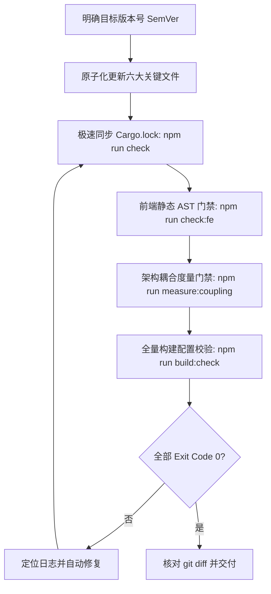

# 桌面应用版本号全链路升级规范 (App Version Upgrade)

本项目采用 **Tauri 2 (Rust) + 原生 Web 前端（HTML / CSS / JS）** 的混合桌面架构。版本号的升级涉及 Node.js 工程、Rust Crate 与 Tauri 配置三大体系。为防止版本漂移与打包配置不一致，必须严格执行**全工程版本原子化同步与四阶门禁闭环**。

---

## 🔄 核心升级流水线



---

## 📋 六大关键文件同步对齐清单

版本号遵循语义化版本规范（Semantic Versioning, 例如 `0.1.2`）。升级时**必须且只能同时**对齐以下 6 个文件中的版本声明，严禁遗漏：

| # | 目标文件 | 关键字段 / 位置 | 示例变更 | 说明 |
|---|---|---|---|---|
| 1 | [`package.json`](../../package.json) | `version` 根字段 | `"version": "0.1.2"` | 前端工程及 npm 脚本的基础版本号 |
| 2 | [`package-lock.json`](../../package-lock.json) | 根字段 `version` 与 `packages[""].version` | `"version": "0.1.2"`（两处） | npm 依赖锁定层，两处版本必须同时对齐 |
| 3 | [`src-tauri/Cargo.toml`](../../src-tauri/Cargo.toml) | `[package].version` | `version = "0.1.2"` | Rust 后端 Crate (`pi-dl`) 声明版本 |
| 4 | [`src-tauri/Cargo.lock`](../../src-tauri/Cargo.lock) | `[[package]] name = "pi-dl"` 下的 `version` | `version = "0.1.2"` | Rust 依赖锁定层（经 `npm run check` 自动同步或手动修正） |
| 5 | [`src-tauri/tauri.conf.json`](../../src-tauri/tauri.conf.json) | `version` 根字段 | `"version": "0.1.2"` | Tauri 桌面端安装包（NSIS 等）打包元数据版本 |
| 6 | [`src-tauri/src/app_meta.rs`](../../src-tauri/src/app_meta.rs) | 模块顶部文档注释 | `//! `pi-desktop-lite/0.1.2`...` | 应用级元信息出口，运行时直接读取 `env!("CARGO_PKG_VERSION")`，注释同步更新防概念漂移 |

---

## 🛠️ 标准升级 SOP（五步闭环）

### 第一步：定位现有版本与工作树状态
1. 检查当前工作树状态：
   ```powershell
   git status -s
   ```
2. 确认当前版本号：
   ```powershell
   grep_search: Query = "\"version\":"
   ```

### 第二步：原子化修改目标文件
严格使用 `replace_file_content` 替换上述 6 处版本字段，保持缩进与格式一致。

### 第三步：极速语法与锁文件同步
运行项目定制的极速检查脚本，验证 Rust 后端语法并自动触发表级 `Cargo.lock` 同步：
```powershell
npm run check
```
- **耗时**：~0.4s
- **预期输出**：`Checking pi-dl v<新版本号>`，`Finished dev profile`

### 第四步：四阶质量门禁验证（核心准则二强制约束）
因为涉及 `tauri.conf.json` 配置与底层版本元信息变更，必须完整执行以下门禁：

1. **后端编译检查**：
   ```powershell
   npm run check
   ```
2. **前端静态校验门禁**（AST 语法 / import 拓扑 / 命名导出匹配 / 循环依赖）：
   ```powershell
   npm run check:fe
   ```
3. **架构耦合度量基线**（确保共享状态裸写为 0、无槽位超额注册）：
   ```powershell
   npm run measure:coupling
   ```
4. **全量构建验证**（强制，验证 Tauri 桌面打包配置与编译期连接）：
   ```powershell
   npm run build:check
   ```
   - 此命令执行 `node scripts/tauri.js build --no-bundle --debug`；
   - 验证 Tauri 的 schema、`withGlobalTauri`、窗口配置及 `pi-dl.exe` 产物正常生成；
   - 必须等待直至 **Exit Code 0**。

### 第五步：核对差异与交付
运行 `git diff` 验证变更范围，确认**仅且仅有**版本相关文件被修改：
```powershell
git diff --stat
```
核对无误后，向用户汇报变更的文件清单、新版本号及校验结果。

---

## ⚠️ 常见踩坑与避坑指南

1. **`package-lock.json` 双处遗漏**：
   - `package-lock.json` 中第 3 行有根 `version`，第 9 行有 `packages[""]` 下的 `version`。如果只改了一处，下次 `npm install` 会发生突发回滚或冲突。
2. **Windows 进程占用文件锁**：
   - 若 `npm run build:check` 报 `failed to remove target\debug\pi-dl.exe: 拒绝访问`，说明前后台仍有 `pi-dl.exe` 或开发服务器运行。需先关闭运行中的桌面端进程后再重新运行。
3. **`app_meta.rs` 单一事实来源**：
   - Rust 后端所有 HTTP 请求的 `User-Agent`（内核检查、组件安装、catalog 抓取）均统一经 `crate::app_meta::user_agent()` 动态读取 `env!("CARGO_PKG_VERSION")`，严禁在其他子模块中硬编码版本字符串。
