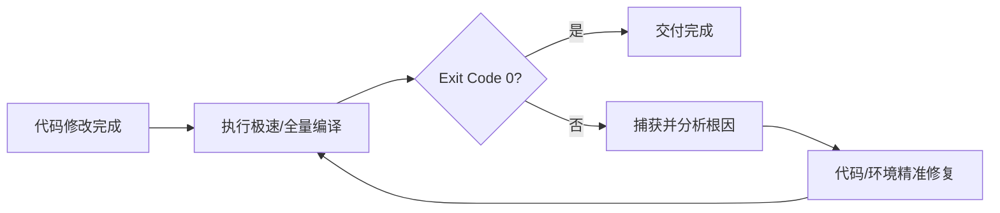

# 任务完成自动编译与循环自愈规范 (Auto Compile & Fix)

在任何代码编写、重构或配置修改任务完成后，必须执行**自动编译与错误自愈闭环**，确保交付代码 Exit Code 0 且无致命错误。

---

## 🔄 核心执行流程

---

## 🛠️ 校验命令与时机

| 项目类型 | 极速校验 (首选，~1s) | 全量/配置变更校验 (~10s) |
|---|---|---|
| **桌面应用 (pi-desktop-lite)** | `npm run check` (或 `cd src-tauri && cargo check`) | `npm run build:check` |
| **Web 前端工程** | `node -c <filePath>` (静态 AST 检查) | `npm run build` |
| **Rust 后端工程** | `cargo check --all-targets` | `cargo build` |

---

## 🔍 错误分类诊断与解决方案

| 错误类别 | 典型报错特征 | 根因与解决方案 |
|---|---|---|
| **Windows 文件锁冲突** | `failed to remove target\debug\pi-dl.exe`, `os error 5: 拒绝访问` | `npm run dev` 在后台运行并锁定了 `.exe`。 👉 **方案**：改用 `npm run check`（仅类型/语法检查，耗时 ~0.3s 且无文件锁冲突）；全量打包前需先关闭运行中的 dev 实例。 |
| **环境变量 / 路径缺失** | `program not found: cargo`, `command not recognized` | 检查 `%USERPROFILE%\.cargo\bin` 或相关 CLI 是否在系统 `PATH` 中并在脚本中注入。 |
| **原生模块/依赖缺失** | `Cannot find native binding`, `ERR_DLOPEN_FAILED` | 检查平台绑定包（如 `@tauri-apps/cli-win32-x64-msvc`），显式 `npm install -D <package>`。 |
| **语法 / 类型 / 借用错误** | `syntax error`, `mismatched types`, `cannot borrow as mutable` | 定位报错文件与精确行号，修正 AST 结构、类型签名或所有权。 |
| **配置文件 Schema 错误** | `invalid JSON`, `missing field` | 校验 `tauri.conf.json`、`Cargo.toml` 与 `package.json` 的字段与结构。 |

---

## 🎯 交付门禁标准

1. **精准修复**：依据诊断日志针对性修正，杜绝引入无用外部改动；
2. **闭环验证**：修复后必须重新执行校验命令，严禁未验证直接交付；
3. **收敛原则**：同一错误重试 3 次未收敛时扩大排查依赖与环境差异，直到编译 **Exit Code 0**。
