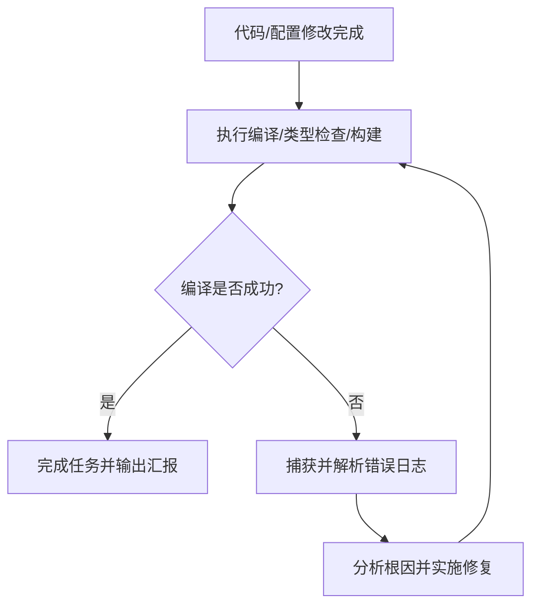

# 任务完成自动编译与循环修复规范 (Auto Compile & Fix)

本 Skill 用于规范在任何代码编写、重构或配置修改任务完成后的**自动编译与错误自愈流程**。确保交付的代码与项目始终处于可正确编译、无致命错误的状态。

---

## 🔄 核心执行流程



---

## 🛠️ 操作步骤指南

### 1. 触发编译检查
在每次完成用户的编码需求或修改后，根据项目类型主动执行对应的编译/校验命令：

- **Tauri / 前端桌面项目**：
  ```bash
  npm run build:check
  # 或在 Rust 层面快速检查
  cd src-tauri && cargo check
  ```
- **Web / Node.js 项目**：
  ```bash
  npm run build # 或 npx tsc --noEmit
  ```
- **Rust 项目**：
  ```bash
  cargo check --all-targets
  ```

---

### 2. 错误捕获与根因分类诊断

当编译命令退出码非 0 时，立即捕获输出日志并进行分类诊断：

| 错误类别 | 典型表现 | 常见根因与解决方案 |
| :--- | :--- | :--- |
| **环境变量 / 路径问题** | `program not found: cargo`, `cmd not recognized` | 检查 `%USERPROFILE%\.cargo\bin` 或相关 CLI 是否在当前环境变量 `PATH` 中，并在 runner 脚本或命令中补充注入。 |
| **依赖 / 原生模块缺失** | `Cannot find native binding`, `ERR_DLOPEN_FAILED` | 检查可选依赖或平台绑定包（如 `@tauri-apps/cli-win32-x64-msvc`），显式执行 `npm install -D <package>`。 |
| **语法 / 类型错误** | `syntax error`, `mismatched types`, `cannot find value` | 定位具体报错文件和行号，审查 AST / 类型定义并修改源码。 |
| **配置文件格式错误** | `invalid JSON`, `missing field` | 校验 `tauri.conf.json`, `Cargo.toml`, `package.json` 的 Schema 与键名。 |
| **资源或依赖未构建** | `frontendDist does not exist` | 检查打包前构建步骤或静态资源目录是否存在。 |

---

### 3. 针对性修复与循环重试

1. **精准修复**：根据诊断结果，使用工具修改代码或修复环境配置，避免引入额外无用改动。
2. **闭环重试**：修复后**必须再次执行编译命令**，严禁在未重新验证的情况下直接结束任务。
3. **收敛原则**：若同一种错误重试 3 次仍未解决，应扩大排查范围（检查底层依赖版本冲突或系统环境差异），直至编译成功。

---

### 4. 成功交付标准

仅当编译/构建命令以退出码 `0`（Success）完成，并且没有致命阻塞性 Warning 时，方可判定任务完成并向用户汇报结果。
