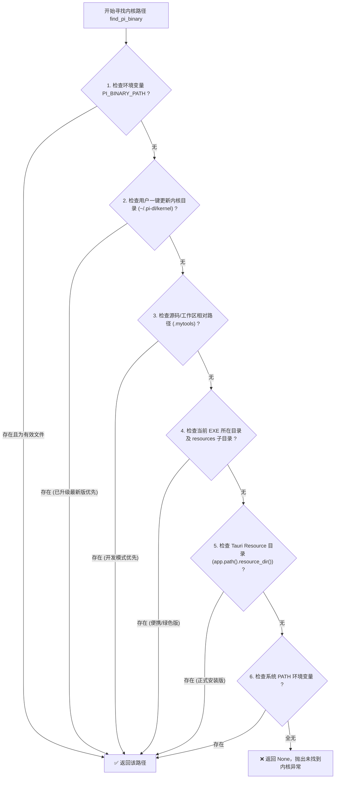

# 桌面端内核生命周期、多环境寻址与 Release 打包避坑指南 (Desktop Kernel Lifecycle & Bundling)

本指南针对桌面端应用（以 **Tauri 2 + Rust + Web 前端** 托管 CLI/Agent 内核引擎，如 `pi.exe`）在**本地开发调试 (`npm run dev`)** 与 **正式打包分发 (`npm run build` / NSIS / MSI / 绿色版)** 全生命周期中的多环境路径寻址、子进程监督、权限隔离与 Windows 运行时六大典型踩坑归因进行系统性总结与工程规范化。

---

## 🧭 一、核心架构：多层次自适应内核寻址管道

在桌面端应用中，内核二进制文件可能存在于：
1. 本地开发仓库根目录（如 `.mytools/pi-body/pi-windows-x64/pi.exe`）；
2. NSIS/MSI 安装包释放的资源目录（`<install_dir>/resources/pi-windows-x64/pi.exe`）；
3. 绿色免安装版同级目录（`<exe_dir>/resources/...` 或 `<exe_dir>/.mytools/...`）；
4. 用户自定义环境变量指定的测试内核；
5. 系统全局 `PATH` 环境变量。

### 📌 寻址优先级铁律（严格按序，不可倒挂）



```rust
pub fn find_pi_binary(app_handle: Option<&AppHandle>) -> Option<PathBuf> {
    // 1. 显式环境变量覆盖（用于特定环境与自动化测试）
    if let Ok(env_path) = std::env::var("PI_BINARY_PATH") {
        let p = PathBuf::from(env_path);
        if p.is_file() { return Some(p); }
    }

    // 2. 检查用户级一键更新内核目录 (~/.pi-dl/kernel/pi-windows-x64/pi.exe)
    if let Some(home) = dirs::home_dir() {
        let user_kernel_candidates = [
            home.join(".pi-dl").join("kernel").join("pi-windows-x64").join("pi.exe"),
            home.join(".pi-dl").join("kernel").join("pi-windows-x64").join("pi"),
            home.join(".pi-dl").join("kernel").join("pi.exe"),
            home.join(".pi-dl").join("kernel").join("pi"),
        ];
        for candidate in &user_kernel_candidates {
            if candidate.is_file() { return Some(candidate.clone()); }
        }
    }

    // 3. 检查当前源码与工作区开发目录 (.mytools/pi-body/pi-windows-x64/pi.exe)
    if let Ok(curr_dir) = std::env::current_dir() {
        let curr_candidates = [
            curr_dir.join(".mytools/pi-body/pi-windows-x64/pi.exe"),
            curr_dir.join("../.mytools/pi-body/pi-windows-x64/pi.exe"),
            curr_dir.join("pi-windows-x64/pi.exe"),
            curr_dir.join("resources/pi-windows-x64/pi.exe"),
            curr_dir.join("pi.exe"),
        ];
        for candidate in &curr_candidates {
            if candidate.is_file() { return Some(candidate.clone()); }
        }
    }

    // 3. 检查 exe 所在目录及其 resources 子目录（便携绿色版与直接分发）
    if let Ok(current_exe) = std::env::current_exe() {
        if let Some(exe_dir) = current_exe.parent() {
            let exe_candidates = [
                exe_dir.join("resources").join("pi-windows-x64").join("pi.exe"),
                exe_dir.join("resources").join("pi-body").join("pi-windows-x64").join("pi.exe"),
                exe_dir.join("pi-windows-x64").join("pi.exe"),
                exe_dir.join(".mytools").join("pi-body").join("pi-windows-x64").join("pi.exe"),
                exe_dir.join("pi.exe"),
            ];
            for candidate in &exe_candidates {
                if candidate.is_file() { return Some(candidate.clone()); }
            }
        }
    }

    // 4. 检查 Tauri Resource 目录（安装包标准资源目录）
    if let Some(app) = app_handle {
        if let Ok(resource_dir) = app.path().resource_dir() {
            let resource_candidates = [
                resource_dir.join("pi-windows-x64").join("pi.exe"),
                resource_dir.join("pi-body").join("pi-windows-x64").join("pi.exe"),
                resource_dir.join("pi.exe"),
            ];
            for candidate in &resource_candidates {
                if candidate.is_file() { return Some(candidate.clone()); }
            }
        }
    }

    // 5. 检查系统 PATH 中的 pi / pi.exe
    if let Ok(path_var) = std::env::var("PATH") {
        let split_char = if cfg!(windows) { ';' } else { ':' };
        let bin_name = if cfg!(windows) { "pi.exe" } else { "pi" };
        for dir in path_var.split(split_char) {
            let full = Path::new(dir).join(bin_name);
            if full.is_file() { return Some(full); }
        }
    }

    None
}
```

---

## ⚠️ 二、Windows 运行时与打包六大踩坑归因深度复盘

### 1. 坑点一：Tauri 2 资源打包相对路径畸变 (`_up_` 陷阱)
- **故障现象**：在 `tauri.conf.json` 中配置数组 `"resources": ["../.mytools/pi-body/pi-windows-x64/**/*"]`，打包后文件被释放到 `resources/_up_/.mytools/...` 畸形目录下，导致程序按原相对路径找不到内核。
- **底层根因**：Tauri 打包器对相对上级路径 `../` 进行了路径清洗（Path Sanitization），自动转义为 `_up_`。
- **治理标准**：**必须使用目录对象映射字典（切忌使用 `/**/*` 通配符导致子目录被扁平化冲刷）**：
  ```json
  "bundle": {
    "resources": {
      "../.mytools/pi-body/pi-windows-x64": "pi-windows-x64"
    }
  }
  ```
  解压后精确存放在 `<install_dir>/resources/pi-windows-x64/` 完整目录树下。

---

### 2. 坑点二：控制台黑框弹出与关闭触发级联崩溃 (Conhost & Accidental Reaper)
- **故障现象**：启动内核时会弹出一个独立的黑色 CMD/Console 窗口。用户手动点击关闭黑框后，前端立刻显示内核 `Crashed`。
- **底层根因**：Windows 下启动控制台子系统（Console Subsystem）程序时，若未指定 `CREATE_NO_WINDOW`（`0x08000000`），系统会强制挂载 Conhost 窗口。用户关闭窗口会向进程发送强杀信号。
- **治理标准**：所有使用 `tokio::process::Command` 或 `std::process::Command` 拉起子进程的地方，统一添加标志位：
  ```rust
  #[cfg(windows)]
  {
      cmd.creation_flags(0x08000000); // CREATE_NO_WINDOW
  }
  ```

---

### 3. 坑点三：工作区隔离与规则防穿透 (`default-area` 与 `AGENTS.md` 隔离规范)
- **故障现象**：
  1. 子进程若直接继承当前未知的父工作目录，若安装在只读目录（如 `C:\Program Files`）下，Agent 在当前目录生成文件或检索项目时会抛出 `EACCES / EPERM` 权限异常导致崩溃；
  2. 开发调试（`npm run dev`）时，Pi CLI 内核会逐级向上寻找 `AGENTS.md`。若工作区未包含独立的 `AGENTS.md`，内核会穿透读取到项目源码根目录的 `AGENTS.md`（该文件为 Antigravity 编码开发规则，而非 Pi 运行时约束），产生行为偏差。
- **底层根因**：子进程工作目录（CWD）未显式指定与自适应隔离，且工作区内缺乏运行时自洽的代理规则文件阻断向上溯源。
- **治理标准**：
  1. 统一在项目与打包体系内置独立的 `default-area` 目录，并在其内部维护 `default-area/AGENTS.md`（Pi 运行时自我描述与工作区规则）；
  2. 探测流水线严格遵循“环境变量 `PI_WORKSPACE` > 源码工作区相对路径 `curr_dir/default-area` (开发态优先) > Release/便携目录 `exe_dir/default-area` > 安装包资源目录 `resource_dir/default-area` > 安全目录兜底创建并播种 `AGENTS.md`”；
  3. `tauri.conf.json` 中配置 `"../default-area": "default-area"`，确保开发态的 `default-area`（包含 `AGENTS.md` 及未来增加的约束/skills）在打包时完整迁移至 Release 资源目录。
  ```rust
  let workspace = self.resolve_workspace().await;
  let _ = std::fs::create_dir_all(&workspace);
  cmd.current_dir(&workspace);
  ```

---

### 4. 坑点四：Windows 环境变量大小写敏感陷阱 (Case-Sensitivity Trap)
- **故障现象**：修改子进程环境变量后，`npm run dev` 启动即秒崩，并在滑动窗口重试 2 次后熔断保持在 Crashed 状态。
- **底层根因**：Windows 操作系统底层环境变量名默认为 `"Path"`，但 Rust `HashMap<String, String>` 大小写敏感。如果使用 `env_map.get("PATH")` 会拿到空字符串，随后重新写入 `"PATH"` 导致环境块中原有的 `C:\Windows\System32`（包含系统 DLL、Socket 通信和基础系统命令）丢失，Node 引擎初始化失败秒崩。
- **治理标准**：
  - 改用 Rust 标准库 `std::env::var("PATH")`（Windows 下原生大小写不敏感）；
  - 直接使用 `cmd.env("PATH", new_path)` 追加路径，严禁全量构建 HashMap 覆盖环境块。
  ```rust
  if let Some(bin_dir) = binary_path.parent() {
      let split_char = if cfg!(windows) { ";" } else { ":" };
      let existing_path = std::env::var("PATH").unwrap_or_default();
      let bin_dir_str = bin_dir.to_string_lossy().to_string();
      if !existing_path.split(if cfg!(windows) { ';' } else { ':' }).any(|p| p == bin_dir_str) {
          let new_path = format!("{}{}{}", bin_dir_str, split_char, existing_path);
          cmd.env("PATH", new_path);
      }
  }
  ```

---

### 5. 坑点五：构建产物污染与探测优先级倒挂 (Target Debug Artifact Contamination)
- **故障现象**：执行过 `npm run build` 后再回到 `npm run dev`，开发态内核 Ready 之后反复崩溃。
- **底层根因**：`tauri build` 会在 `src-tauri/target/debug/` 下生成不完整的临时资源目录。在 `dev` 模式下 `app.path().resource_dir()` 指向了 `target/debug/`。如果探测顺序中 `resource_dir` 优先于源码工作区目录，`dev` 模式就会误载入 `target/debug` 下残缺的 `pi.exe`。
- **治理标准**：
  - 严格保持 **源码工作区相对路径优先于 Resource Dir**；
  - 在构建测试脚本中加入残缺临时资源的自动清理逻辑。

---

### 6. 坑点六：Win32 Job Object 作业对象限制与孤儿收割 (Job Object Silent Breakaway)
- **故障现象**：通过安装包向导完成页勾选“立即启动”时，子进程在派生工具（如调用 bash/git/npm）时报错或被提前终止。
- **底层根因**：NSIS 安装器本身可能运行在临时 Job Object 中。如果宿主应用创建的 Job Object 未开启静默脱离标志位，子进程在衍生下一级进程时会触发 Win32 嵌套限制错误。
- **治理标准**：在 `JobObjectManager` 初始化时设置 `JOB_OBJECT_LIMIT_SILENT_BREAKAWAY_OK`：
  ```rust
  let mut info: JOBOBJECT_EXTENDED_LIMIT_INFORMATION = std::mem::zeroed();
  info.BasicLimitInformation.LimitFlags =
      JOB_OBJECT_LIMIT_KILL_ON_JOB_CLOSE | JOB_OBJECT_LIMIT_SILENT_BREAKAWAY_OK;
  ```

---

### 7. 坑点七：大文件流式下载客户端超时截断与断流解码异常 (`error decoding response body`)
- **故障现象**：调用 `response.chunk().await` 流式下载内核压缩包（~45MB）时中途报错：`Error while downloading kernel bytes: error decoding response body`。
- **底层根因**：
  1. `reqwest::Client` 设置的全局 `timeout(Duration::from_secs(60))` 作用于整个请求全生命周期。官方内核包在网速慢或跨国 CDN 延迟较高时，下载耗时一旦超过 60 秒即被客户端强行截断连接；
  2. GitHub Releases (AWS S3) 在国内直连经常丢包或遭遇 TCP RST 连接重置；
  3. 未显式声明 `Accept-Encoding: identity` 时，反向代理可能与客户端发生压缩传输头协商异常。
- **治理标准**：
  1. **超时解耦与长连接配置**：将流式下载总超时放宽至 `600s`（10分钟），并设置 `15s` 短连接超时；
  2. **强制原始二进制直传**：显式注入 `.header(reqwest::header::ACCEPT_ENCODING, "identity")`；
  3. **高可用镜像候选链与自动断流重试 (Multi-Source Mirror Fallback)**：配置官方直连与加速镜像候选链（`GitHub Direct` ➔ `ghproxy.net` ➔ `gh-proxy.com` ➔ `mirror.ghproxy.com`），下载中断时自动清理临时文件并无缝切换至下一节点重试。

---

### 8. 坑点八：内核热更新中断取消与临时文件残留泄露治理
- **故障现象**：用户在网络较慢时点击“取消更新”，若无原子取消信号控制，后台后台线程仍持续下载并尝试解压替换正在运行的内核，导致正在对话的内核意外被终止，或者产生未清理的 `temp/`、`kernel_staging/` 孤儿文件。
- **底层根因**：
  1. 缺少全局线程安全的原子取消标志（`AtomicBool`）；
  2. 流式下载与解压各阶段未插入取消探测点；
  3. 未在中断时回滚并安全清理临时文件。
- **治理标准**：
  1. **原子取消信号与指令**：暴露 `pi_cancel_kernel_update` 指令，在流式分块循环、候选源切换、解压与停止 supervisor 前严格自检取消信号；
  2. **取消立即安全清理**：取消触发时安全关闭文件句柄并删除 `temp/` 压缩包与 `kernel_staging/`，保持原 supervisor 内核进程正常运行不受任何影响；
  3. **交互去冗余与持久化控制**：进度显示仅保留最右侧百分比；提供“不再提醒更新”持久化（`~/.pi-dl/config.json`），配置后彻底跳过启动自检与后台自动轮询（零网络请求），用户主动点击“检查更新”时重置恢复；“已是最新版本”与“更新成功”提醒框 8 秒平滑自动渐隐。

---

## 🛠️ 三、交付与排查核对清单 (Checklist)

在开发与交付包含内置内核的桌面端应用时，必须执行以下核对：

- [ ] `tauri.conf.json` 中 `bundle.resources` 是否采用对象映射（如 `"../.mytools/...": "target-dir"`）而非相对路径数组？
- [ ] 所有子进程拉起命令是否配置了 `#[cfg(windows)] cmd.creation_flags(0x08000000)`？
- [ ] 子进程工作目录（CWD）是否具备权限容错机制？
- [ ] 子进程 PATH 追加是否使用 `std::env::var("PATH")` 与 `cmd.env("PATH", ...)` 避免环境块大小写损坏？
- [ ] 内核寻址探测优先级是否将源码工作区（`.mytools`）置于 `target/debug` 之前？
- [ ] Win32 Job Object 是否配置了 `JOB_OBJECT_LIMIT_SILENT_BREAKAWAY_OK`？
- [ ] 内核大文件下载是否配置了长超时（600s）、`Accept-Encoding: identity` 及多镜像节点容灾切换？
- [ ] 内核更新流是否支持取消指令 (`pi_cancel_kernel_update`)，且取消时完全清理临时产物并不终止运行中的 supervisor？
- [ ] “不再提醒更新”是否正确持久化至 `~/.pi-dl/config.json` 且在手动“检查更新”时自愈重置？

