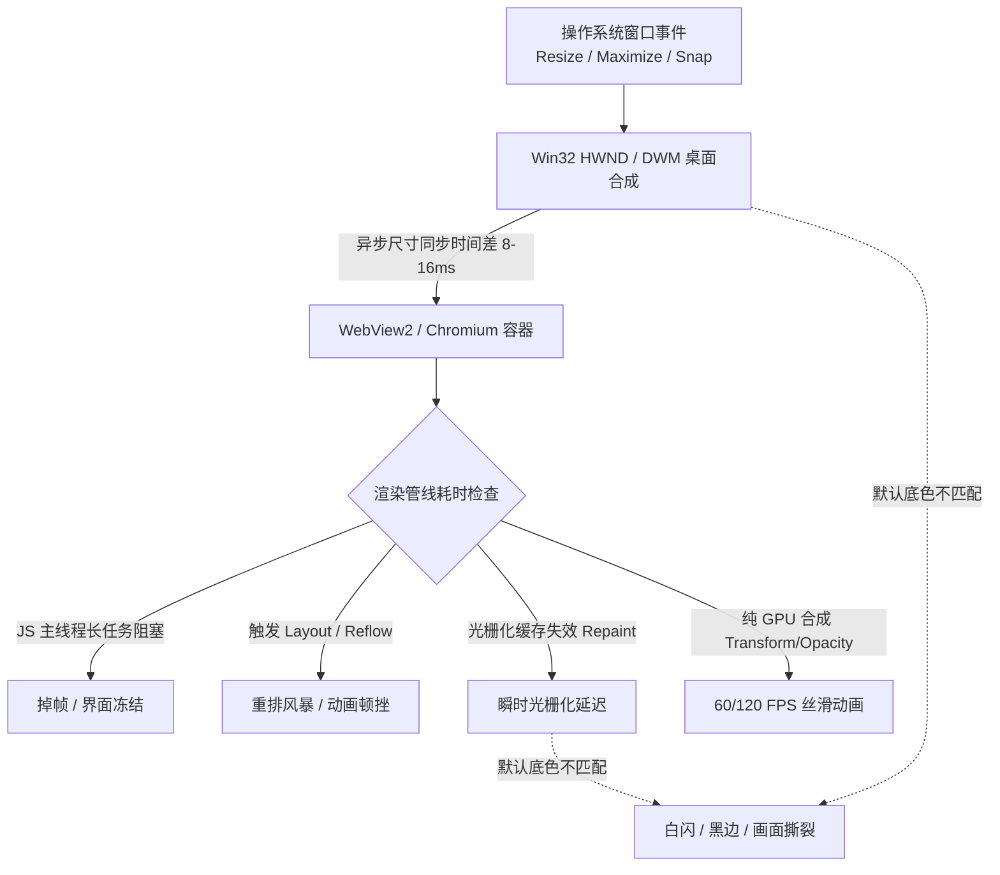

# 桌面端与 Webview 渲染性能与动画帧异常诊断优化规范

本 Skill 汇总了在桌面端混合应用（Tauri / Electron / WebView2）及现代 Web 前端中，导致**窗口缩放闪白、动画卡顿、掉帧（Frame Drops）、画面撕裂与视觉顿挫**的全部根因分析，并提供工程化排查清单与标准优化方案。

---

## 🎯 核心问题归因模型：为什么会发生帧异常？

桌面端混合应用的渲染流程涉及 **操作系统窗口合成器 (OS DWM) $\leftrightarrow$ Webview 容器 $\leftrightarrow$ 浏览器渲染引擎 (Chromium/WebKit)** 三层协同。任何一层的节拍脱节或配置冲突，都会导致视觉帧异常：



---

## 🧭 六大动画帧异常场景与排查指南

### 1. 窗口宿主与 OS 桌面合成异常（窗口缩放白闪/黑边）

| 异常表现 | 核心根因 | 根治方案 |
| :--- | :--- | :--- |
| **拖拽/最大化闪白边** | DWM 瞬间扩展窗口尺寸，而 WebView2 异步重排需 1~2 帧，底层暴露了默认白色 Clear Color (`#FFFFFF`)。 | ① 在 `tauri.conf.json` 中配置 `"transparent": true`；<br>② Rust 中通过 `window.set_background_color(Some(tauri::window::Color(0,0,0,0)))` 设置透明通道；<br>③ `<head>` 中添加 `<meta name="color-scheme" content="light dark">`。 |
| **全屏切换/贴边吸附撕裂** | 无边框窗口（`decorations: false`）在 DPI 跨屏缩放或 Snap Layout 时未处理非客户区重绘。 | 监听系统窗口事件，避免在窗口变动瞬间触发重型 CSS 过渡动画。 |
| **图层合成过度消耗** | 无节制使用 `will-change` 或 `transform: translateZ(0)` 导致显存暴涨，触发 GPU 降级。 | 仅对活跃运行动画的单一元素添加 `will-change`，并在动画结束后移除。 |

---

### 2. 渲染管线阻塞与非合成属性（Reflow / Repaint Storm）

| 异常表现 | 核心根因 | 根治方案 |
| :--- | :--- | :--- |
| **位移/缩放动画卡顿** | 动画直接操作 `top`, `left`, `width`, `height`, `margin` 等几何属性，强制每一帧重新计算 Layout 与 Paint。 | **严格仅使用 GPU 合成器属性**：`transform: translate3d()/scale()` 和 `opacity` 进行动画。 |
| **视口拉伸重绘顿挫** | CSS 中存在 `background-attachment: fixed`，视口尺寸改变时强制使 GPU 纹理缓存失效并全屏重绘。 | 移除 `background-attachment: fixed`，改用 `html`/`body` 独立层 + `background-size: cover` 或 `100% 100%`。 |
| **毛玻璃与大阴影卡顿** | 频繁对带有深层 `backdrop-filter: blur(...)` 或超大半径 `box-shadow` 的容器做位移动画。 | 对毛玻璃背景做独立图层隔离（`contain: paint`），动画作用于轻量外壳。 |

---

### 3. 布局抖动与强制同步布局（Layout Thrashing）

```javascript
// ❌ 错误示范：交替读写 DOM 几何属性，导致浏览器在单帧内进行多次昂贵重排（掉帧根源）
elements.forEach(el => {
  const height = el.offsetHeight; // 读取（强制即时 Layout）
  el.style.height = (height + 10) + 'px'; // 写入（使 Layout 失效）
});

// ✅ 正确示范：批量读取 -> 批量写入，或使用 requestAnimationFrame 调度
const heights = elements.map(el => el.offsetHeight); // 统一读取
requestAnimationFrame(() => {
  elements.forEach((el, i) => {
    el.style.height = (heights[i] + 10) + 'px'; // 统一写入
  });
});
```

---

### 4. 主线程长任务与事件积压（Main Thread Long Tasks）

1. **高频事件未节流**：
   - 监听 `resize`, `scroll`, `pointermove`, `mousemove` 时直接执行复杂计算或 DOM 操作；
   - **方案**：使用 `requestAnimationFrame` 防抖节流，或接入 `ResizeObserver` / `IntersectionObserver`。
2. **CPU 密集型运算阻塞主线程**：
   - 大体积 JSON 解析、大数组排序、模糊搜索正则匹配超过 16.6ms（导致跳帧）；
   - **方案**：将计算任务卸载到 **Rust 后端 Tauri Command** 或 Web Worker 执行，主线程仅接收结果。

---

### 5. 动画调度机制漂移（Timer vs VSync）

| 调度方式 | 帧率同步状态 | 适用场景与评价 |
| :--- | :--- | :--- |
| `setTimeout` / `setInterval` | ❌ **不与显示器刷新率同步**，受宏任务排队影响存在 4~15ms 抖动。 | 严禁用于 UI 视觉动画；仅用于业务定时器。 |
| `requestAnimationFrame` (rAF) | ✅ **严格对齐显示器 VSync 垂直同步信号**（60Hz/120Hz/144Hz）。 | 推荐用于 JS 驱动的连续物理动画与手势拖拽。 |
| **CSS Transitions / Keyframes** | 🌟 **最高优先级（独立合成器线程 Compositor Thread 运行）**。 | 主线程卡顿阻塞时，CSS 硬件加速动画仍可维持满帧运行。 |

---

### 6. 资源解码与内存泄漏（Asset & Resource Latency）

1. **大图同步解码阻塞**：
   - 视口进入未解码的高分辨率 PNG/JPEG，主线程同步解码造成瞬间掉帧。
   - **方案**：图片添加 `decoding="async"` 与 `loading="lazy"`，小图标优先使用 SVG 内联。
2. **未注销的动画与观察器**：
   - 组件销毁后未取消 `cancelAnimationFrame(id)` 或未调用 `observer.disconnect()`，导致后台持续消耗 CPU 甚至引发 GC 停顿（GC Pauses）。

---

### 7. 冷启动主题闪烁与首屏闪白/闪黑 (Theme FOUC Prevention)

| 异常表现 | 核心根因 | 根治方案 |
| :--- | :--- | :--- |
| **系统深色+软件浅色冷启动闪黑后变浅** | 页面加载时未在 CSS 解析前设置 `data-theme`，系统 `@media (prefers-color-scheme: dark)` 率先匹配导致首屏暗色渲染，待异步 JS 读取配置后再切回浅色。 | ① 在 `index.html` 的 `<head>` 顶端（样式表前）插入同步内联 `<script>` 从 `localStorage` 读取并立即为 `<html>` 赋予 `data-theme` 属性；<br>② CSS 媒体查询中深色样式必须严格绑定 `:root[data-theme="system"]` 与 `:root:not([data-theme="light"]):not([data-theme="dark"])`，禁止无前缀覆盖；<br>③ 配置服务与设置 UI 在启动时同步读取初始化，杜绝等待后端 IPC 导致状态跳变。 |

---

## 🛠️ 桌面端流畅度调优实操 Checklist

- [ ] **1. 原生层配置**：`tauri.conf.json` 中配置 `"transparent": true`，消除窗口缩放底色冲突。
- [ ] **2. 根画布声明**：`index.html` 顶部加入 `<meta name="color-scheme" content="light dark">`。
- [ ] **3. 首屏防闪烁**：`<head>` 顶端插入同步内联主题注入脚本，彻底杜绝冷启动主题闪跳 (Theme FOUC)。
- [ ] **4. 移除重绘杀手**：全站样式排查并彻底清除 `background-attachment: fixed`。
- [ ] **5. 动画属性审计**：所有过渡动画必须且仅使用 `transform` 与 `opacity`。
- [ ] **6. 图层隔离**：对独立动画区域使用 `contain: paint` 或 `contain: layout` 限制重绘边界。
- [ ] **7. 视口尺寸调整抑制**：窗口拖拽/最大化瞬间避免触发全局 `transition: all`。
- [ ] **8. 后端卸载重运算**：数据处理交由 Rust 后端执行，保持 Web 前端主线程 0 阻塞。
