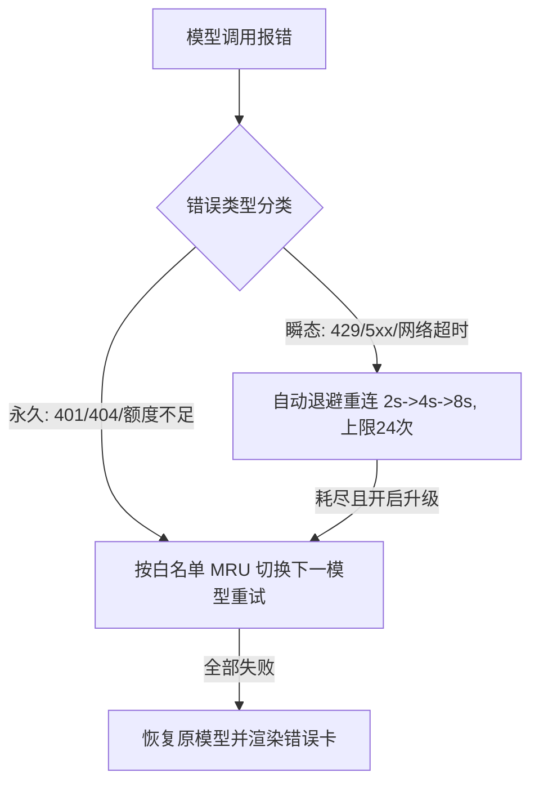

# Flow 交互界面规范 (Flow Interaction Pattern)

本技能定义 Flow 流式交互界面（`界面3 / data-view="flow"`）的架构分层、切片流水线、滚轮委托、轮次导航、模型自愈与会话净化规范。

---

## 🏛️ 1. 架构分层与核心铁律

```text
#app-container            ← 全局容器 (position: relative; overflow: hidden)
  ├─ flow-stage           ← Flow 主体 (max-width: 760px 居中)
  │    └─ flow-scroll-area ← 唯一可滚动容器 (overflow-y: auto)
  │         ├─ flow-question-tip      ← 顶部悬浮提问提示 (sticky top: 0, pointer-events: none)
  │         └─ flow-conversation
  │              └─ flow-message-group
  │                   ├─ flow-user-prompt-card       用户提问卡（右侧 prompt-copy-btn 一键复制提问，事件委托于 flow-conversation）
  │                   ├─ flow-route-capsule          路由目标项目胶囊
  │                   ├─ flow-injection-notice        「注入提示」信息框 (路由胶囊下方；直角简洁风，默认收起显示「注入提示」与注入数量，点击展开全部注入条目清单)
  │                   ├─ flow-failover-capsule       自动重连/切换进度胶囊
  │                   ├─ flow-steps-container        【时序步骤流容器】
  │                   │    ├─ flow-step-thinking     思维切片 (单行刷新，常态折叠，绝不自动展开)
  │                   │    ├─ flow-step-phase        阶段性输出 Point 切片 (读秒+折叠内容，绝不自动展开)
  │                   │    ├─ flow-step-tool         工具切片 (单行状态徽章+读秒，常态折叠，绝不自动展开)
  │                   │    └─ tool-pseudo-card      伪工具运行框 (参数流式期占位，虚线边框，真实卡就位即移除)
  │                   └─ flow-response-card          最终输出正文 (Typedown 质感 Markdown，永不折叠)
  ├─ flow-turn-nav        ← 右侧上下轮次定位导航 (多轮 >= 2 显现，右移至内容区外)
  └─ search-section       ← 底部输入区
```

### 核心铁律
1. **最终输出卡永不折叠**：`flow-response-card` 始终完全展开渲染 Markdown；
2. **过程框体单行紧凑折叠**：思维切片、Point 阶段切片与工具切片在任何阶段（启动、流式、完成）**绝不自动展开**，支持手动点击 Header 展开详情；
3. **真实 ReAct 时序交织**：步骤按 `思维1 ➔ 工具1 ➔ 思维2 ➔ 工具2 ➔ ...` 一段一段流式拼接。

---

## 📌 2. 步骤切片与流式流水线

| 切片类型 | 视觉语义与展示规范 | 展开正文与交互细节 | 触发与封口时机 |
|---|---|---|---|
| **思维链切片 (`flow-step-thinking`)** | **石墨幽兰冷灰调**（`#f7f6fb` / `#1b1a21`），`Thinking` 手绘胶囊 + 星芒自旋呼吸，动态读秒 `(1.2s)...` ➔ 定格 `(3.2s)`，单行流式预览；默认折叠。 | 细致思考日志流（字号 12px，行高 1.68，石墨淡墨色 `--ink-muted`），柔和内边距与虚线分割。 | `thinking-start` 创建；`tool-start` 或 `text-start` 时封口。 |
| **阶段性输出切片 (`flow-step-phase`)** | **温润羊皮纸金调**（`#fdfbf5` / `#201d17`），`Point` 手绘暖调胶囊 + 铅笔图标 + 读秒 `已输出 1.2s`；默认折叠。 | 阶段 Markdown 完整渲染（富文本、代码块、列表、引用），内嵌暖调微衬边。 | 首个 `text-delta` 创建；文本段之后再次进入 Thinking（`thinking-start`）或进入工具调用（`toolcall-delta-start` / `tool-start`）时封口；新轮 `text-start` 封口上一段；最终段保留在输出卡。 |
| **工具调用切片 (`flow-step-tool`)** | **蓝图终端工程调**（`#f2f6fa` / `#141920`），按工具智能映射矢量图标（CLI/文件/搜索/OCR等）+ 中文友好名 + 参数预览 + 三态状态徽章 (`running` 琥珀黄 / `done` 翡翠绿 / `failure` 朱红) + 运行期递增读秒 `(1.2s)...` ➔ 封口定格 `(3.2s)`；默认折叠。 | 结构化拆分 `入参 · Parameters` 与 `执行结果 · Result`，仿终端代码块包装，右上角提供手绘一键复制与复制成功即时微反馈。 | `tool-start` 创建；`tool-end` 封口并更新状态与定格读秒。 |
| **伪工具运行框 (`tool-pseudo-card`)** | **蓝图虚线占位调**（复用工具卡配色 + 虚线边框 + 降不透明度），通用「工具调用...」标题 + running 徽章 + 100ms 递增读秒，工具图标轻微呼吸摆动；无展开正文。 | 无（纯占位单行卡）。 | `toolcall-delta-start` 创建（覆盖工具参数流式期空窗延迟）；`toolcall-delta-end` 回填真实工具名（如「工具调用(edit)」）；`tool-start` 真实卡创建时移除；`thinking-start` / `text-start` / `finalizeStream` 兜底清理。 |

### 伪框占位机制 (Pseudo Placeholder Cards)

对齐「伪思考框」首 token 延迟显示机制，工具调用同样存在两段空窗延迟，均需即时视觉反馈：

1. **伪思考框**：`thinking-start` 即插入 `Thinking (0.0s)...` 占位思维切片，100ms 读秒；真正捕捉到思维链 delta 后流式刷新首行预览，封口时若从未收到任何思维内容则直接移除；
2. **伪工具运行框**：`toolcall-delta-start`（工具参数流式开始）即插入 `工具调用... + running + (0.0s)...` 占位卡（`flow-pipeline.js` 的 `ensureActiveToolPseudoStep`），100ms 读秒；参数流式结束（`toolcall-delta-end` 携带 `toolCall.name`）回填真实工具名；真实工具卡创建（`tool-start`）时移除占位卡，避免双卡重叠；
3. **真实工具卡读秒**：`tool-start` 创建卡片时携带 `durationText: "(0.0s)..."` 与 `startTime`，`startToolRunTimer` 每 100ms 刷新读秒；`tool-end` 定格为 `(Xs)` 并清空 `flow.toolRunTimerInterval`；
4. **状态清理铁律**：伪框与读秒计时器（`flow.activeToolPseudoStep` / `flow.toolPseudoTimerInterval` / `flow.toolRunTimerInterval`）必须在 `resetStreamState`、`resetCurrentTurnForResend`、`finalizeStream`、`thinking-start`、`text-start` 全部边界兜底清理，杜绝幽灵计时器与残留占位卡；伪卡不写入 `flow.currentSteps`，不污染历史快照。

### 历史快照卡片重绑铁律 (Snapshot Card Rebinding)

历史/Task 记录回入 Flow 时，轮次卡片有两条渲染路径，监听器绑定策略必须严格区分，否则一次点击 toggle 两次互消（表现为收起状态无法点开）或快照卡彻底死卡：

- **工厂新建路径**：`steps` 快照经 `createThinkingStepCard` / `createPhaseStepCard` / `createToolStepCard` 工厂创建，工厂内部已绑定 Header 点击/键盘折叠监听，并以 expando 标记 `headerEl.__piBound = true`（expando 不随 outerHTML 序列化，不污染归档快照）；
- **outerHTML 快照路径**：`toolCalls[].html` 快照经 `insertAdjacentHTML` 解析插入，解析后节点不带任何监听器（且 Header 上可能残留旧版 `data-bound="1"` 标记，一律忽略）；`createFlowTurnGroupElement` 末尾的重绑循环仅处理无 `__piBound` 标记的快照卡，并补齐点击与键盘两种触发；
- **严禁**在重绑循环中以 `header.dataset.bound` 作为跳过依据：工厂卡未设置过该 dataset、而快照卡却携带旧标记，双重绑定/漏绑双象限全错（历史缺陷根因）。

---

## 📌 3. 滚轮委托与吸底跟随策略

### 3.1 window 捕获阶段滚轮委托
```javascript
// 在 window 捕获阶段拦截，防止子元素消费后无法滚动外层
window.addEventListener("wheel", (e) => {
  if (currentView !== VIEW_FLOW || !flowScrollArea) return;
  const inner = e.target.closest(".thinking-body, .tool-body");
  if (inner) {
    const canUp = e.deltaY < 0 && inner.scrollTop > 0;
    const canDown = e.deltaY > 0 && inner.scrollTop < inner.scrollHeight - inner.clientHeight - 1;
    if (canUp || canDown) return; // 子区域还有滚动空间时放行
  }
  e.preventDefault();
  flowScrollArea.scrollTop += e.deltaY;
}, { passive: false, capture: true });
```

### 3.2 吸底跟随 (Sticky Bottom Follow)
- **跟随开启**：滚动到底部（距底 ≤ 32px）置 `flow.followBottom = true`；
- **跟随终止**：用户主动向上滚动时置 `flow.followBottom = false`，流式事件不再拉扯视口；
- **单次定位**：提交新提问、流式完成（`finalizeStream`）及终止提示追加后强制定位到底部。

---

## 📌 4. 悬浮提问提示与上下轮次导航

### 4.1 顶部悬浮提问提示 (`Flow Floating Question Tip`)
- **触发条件**：处于 Flow 视图且内容溢出（`scrollHeight > clientHeight + 1`）；
- **形态**：`position: sticky; top: 0; pointer-events: none;`，靠左对齐，未溢出零占位；
- **轮次锚定**：根据滚动位置动态取顶部高于/等于视口顶边的最后一个消息组的提问。

### 4.2 右侧上下轮次定位导航 (`Flow Turn Navigation`)
- **展示**：多轮对话（`groups >= 2`）时在内容区右侧显现，由 JS 动态对齐内容区底部；
- **定位目标**：每轮最终输出内容顶部（`.flow-response-card`），扣除顶部提示吸附高度；
- **「上」两段式优化定位 (`OUTPUT_TOP_PROXIMITY_PX = 100`)**：
  - 视口顶边距当前轮输出顶部 ≤ 100px（含上方思考/提问区）➔ 定位到**第 N-1 轮**输出顶部；
  - 视口顶边深入当前轮输出 > 100px ➔ 先定位到**第 N 轮**输出顶部；
- **「下」与长按 1.5s 立即触底**：
  - 单击弹起定位到下一轮输出顶部；
  - 按住满 1.5 秒立即定位到会话最底部（伴随左至右背景填充与轻微抖动动画），弹起不再重复触发；
- **交互铁律**：定位均在 `mouseup` 触发；`mouseleave` 立即作废按下状态。

---

## 📌 5. 后台任务、双通道解耦与中断发送

### 5.1 挂起与终止双通道
- **通道 1：后台挂起 (Esc / 右键)**：`isSuspended = true` 转入后台 `TaskManager`，界面回退至 Focus 专注版，绝不调用 `abort`；
- **通道 2：显式中止 (⏹ 按钮)**：彻底杀死 Agent 生成，追加手绘草图风格「刚刚会话已手动终止」提示（`.flow-abort-callout`）。

### 5.2 手动终止绝对禁止触发重连铁律
用户点击「⏹ 终止」时，系统立即执行 `modelFailoverEngine.markTaskAborted(taskId)` 与 `cancel()`，**全链路严禁触发任何自动重连或模型切换**。

### 5.3 运行中提交拦截与「终止并发送」
- 运行中提交输入时弹出 `sketchConfirm`（“终止并发送” / “等待完成”）；
- 选择“终止并发送”：先注册 `waitForTurnSettled(taskId)`（6s 兜底），再 `piClient.abort(taskId)`，旧轮定格为「已中断」，旧轮结算后才开启新轮，彻底杜绝内容串轮。

### 5.4 后台任务流式串轮过滤铁律 (Foreground Stream Gate)
- **事件帧归属追踪**：`piClient` 在 `handleAgentEvent` / `handleMessageUpdate` 中记录每帧 RPC 的 `task_id` 至 `piClient.lastEventTaskId`（同步派发窗口内可靠）；
- **前台门禁判定**：`taskManager.isForegroundStreamTask(taskId)` —— 事件携 `task_id` 且 ≠ 当前前台活跃任务（含挂起态 `currentActiveTaskId = null`）时视为后台事件；缺失 `task_id` 时视为前台主会话向后兼容；
- **UI 层全量门禁**：`flow-stream.js` 与 `flow-pipeline.js` 的全部流式监听器（thinking/text/toolcall/tool/agent/retry/注入提示框条目）入口处统一执行 `isForegroundStreamEvent()` 过滤——后台挂起任务的增量只入 `TaskManager` 数据缓冲（供侧边栏与恢复展示），**绝不触碰前台 Flow DOM、流式状态、错误卡与收尾归档**；
- **历史会话恢复场景**：从历史记录/会话记录进入 Flow 时，后台旧任务继续输出也绝不拼进历史轮次 DOM；仅当该任务被重新置为前台活跃任务时才恢复流式渲染。

---

## 📌 6. 模型自动重连切换引擎 (ModelFailoverEngine)



- **进度胶囊**：展示「自动重连中 3/24 · 8s 后重试」或「正在自动切换至 <模型>」；
- **MRU 保护**：重试期间仅临时切换，候选模型成功输出后才持久化置顶 MRU。

---

## 📌 7. Typedown 质感 Markdown 与超链接

- **Markdown 引擎**：流式容错修补未闭合代码围栏/表格；支持多级标题、GFM 表格、任务列表与 GitHub Callouts；
- **代码块**：语言徽标 + 手绘「复制」按钮（1.8s 成功微反馈）+ 轻量语法高亮；
- **外部链接**：全域 HTTP/HTTPS 链接拦截并通过 Rust `pi_open_url` 唤起系统默认浏览器；
- **一键保存**：回答卡底部手绘「保存」按钮，一键将完整对话保存为桌面 `.md` 文件。

---

## 📌 8. 历史会话还原与上下文脱敏

- **Rust 后端原生净化**：`strip_injected_contexts` 与 `clean_user_prompt` 递归剥离 `<runtime_context_rules>`、`<code_area_routing_context>` 与附件绝对路径尾注；
- **前端纵深防御**：历史列表与提问卡 100% 还原用户原始纯净输入。

---

## 📌 9. 会话文件变更收纳框 (flow-file-changes)

模型执行文件写入/编辑/删除类工具后，会话完成时在会话流末尾以轻盈通透的纯透明框体汇总呈现「新增 / 修改 / 删除」的文件清单：

- **触发工具集合**：写入类 `write / write_file / write_to_file / create_file / save_file`；编辑类 `edit / edit_file / replace_file_content / multi_replace_file_content / apply_patch / apply_diff / str_replace_editor / insert_content`；删除类 `delete_file / remove_file / unlink` 等；Shell 类 `bash / powershell / cmd` 等（定义于 `src/modules/flow-file-changes.js`）；
- **新增/修改判定**：`tool-start` 时对写入类工具经 Rust `pi_path_exists` 异步探测路径写入前是否存在，并以 **Promise 形式存起**（`tool-end` 时 `await` 取回，消除探测 IPC 未返回而 tool-end 已到的竞态 → 新增文件不再误判为修改）；工具成功 + 写前不存在 → 新增；其余 → 修改；探测失败按修改兑底；
- **收集与去重**：`tool-end` 仅收集执行成功的工具调用（`isError` 跳过），路径从工具入参提取（兼容 JSON 字符串与 `edits/files/changes` 多文件入参结构），按规范化路径去重保留最新动作；
- **会话流缓存铁律（程序生命周期级）**：每个 Task 一份独立文件变更缓存仓（`sessionStores: Map<taskId, { items, collapsed }>`，定义于 `flow-file-changes.js`），前后台任务均持续收集（事件按 `piClient.lastEventTaskId || taskManager.currentActiveTaskId` 归入各自缓存仓），直至应用退出才释放；右键退出 Flow（挂起/归档）后经历史记录 / Task 记录回入时，由共享渲染器 `renderTurnsIntoFlow`（`task-panel.js`）调用 `api.restoreFileChangesFor(task.id)` 恢复收纳框，呈现与退出前完全一致；后台任务变更事件仅写入缓存仓，绝不触发前台 DOM 渲染；
- **删除识别与去伪（工作目录感知）**：显式删除类工具执行成功即记为「删除」；Shell 类工具启发式解析命令文本中 `rm / del / Remove-Item` 目标路径，并在命令执行成功后经 `pi_path_exists` 复核（路径确实消失才记为删除，杜绝误报）；**候选路径必须先经工作目录归一化再探测**：内核 Shell 实际 CWD ≠ 桌面端进程 CWD，`cd <dir> && rm <相对路径>`、MSYS 风格 `/c/Users/...`、`~` 与 `[USER_HOME]` 直接探测全部失真 → `existedBefore=false` 被去伪规则误杀（历史缺陷根因：删除示意信息在收纳框中消失）；故 `extractDeletedPathsFromCommand(commandText, baseDirs)` 按 `&&/;/|/换行` 切段顺序扫描并维护 `cd` 链路工作目录，配合 `loadBaseDirs()`（真实主目录 + 路由工作区会话 CWD 兑底）把每个目标归一化为绝对路径，tool-start 探测与 tool-end 复核双侧统一取基准，保证配对一致；解析失败退化为原文，绝不虚报；删除为终态，同一文件多动作合并时永远胜出；
- **展示时机**：`agent-end` 正常收尾后经 `api.showFileChangesBox()` 渲染于会话流末尾（渲染前先 `syncViewToStore` 对齐当前活跃任务缓存仓，跨轮置底累积，整条可折叠展开且折叠态回写缓存仓，平滑贝塞尔旋转过渡）；全新会话由 `api.resetFileChanges()` 清视图态（`flow-stream.js` resetStreamState 非 followUp 分支调用，会话缓存仓保留不释放）；
- **头部统计指示 (Summary Pills)**：头部右侧展示直观的分类统计（`+N 新增` / `~N 修改` / `-N 删除`）以及总数 `N 个文件`，取消胶囊边框+背景色，纯透明背景，折叠态亦可一目了然；
- **打开所在文件夹**：点击条目经 Rust `pi_reveal_path` 在 Windows 资源管理器中高亮定位该文件（`tauri_plugin_opener::reveal_item_in_dir`）；**删除类条目直接定位其原所在文件夹（上级目录）**，避免完整路径因父目录解析异常而退化为打开「我的文档」，并弹全局 Toast 反馈；
- **核心标识外观与高级配色 (Kind Badges)**：
  - **取消胶囊边框+背景色**：采用纯透明背景（`background: transparent; border: none; box-shadow: none;`），无多余药丸状方块或边框，纯净通透；
  - **新增 (kind-add)**：加号 SVG + 文本；浅色采用翠绿色 `#047857`；深色采用碧玉荧绿 `#34d399`；
  - **修改 (kind-modify)**：笔触 SVG + 文本；浅色采用琥珀金色 `#b45309`；深色采用暖阳流金 `#fbbf24`；
  - **删除 (kind-delete)**：垃圾桶 SVG + 文本；浅色采用胭脂朱红 `#be123c`；深色采用珊瑚粉红 `#fb7185`；条目名称带轻微删除线修饰；
- **自适应宽度与路径截断（杜绝横向滚动条）**：
  - 收纳框外层、头部、列表与条目统一采用 `width: 100%; max-width: 100%; box-sizing: border-box; overflow: hidden;`，禁止负外边距；
  - 列表强制 `overflow-x: hidden;`，绝不触发横向滚动条；
  - 文件名（`max-width: 45%`）与目录路径（`flex: 1 1 0`）自适应收缩，过长文本统一以 `...` 省略号优雅截断，hover 可见全路径 tooltip；
  - 条目常态背景透明，悬浮/聚焦显手绘微边框与极淡背景，右侧平滑浮现“定位”提示与手绘文件夹图标。


