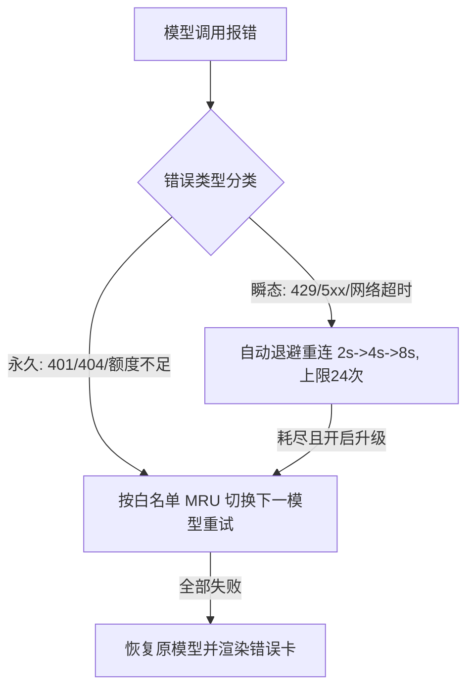

# Flow 交互界面规范 (Flow Interaction Pattern)

本技能定义 Flow 流式交互界面（`界面3 / data-view="flow"`）的架构分层、切片流水线、滚轮委托、轮次导航、模型自愈与会话净化规范。

---

## 🏛️ 1. 架构分层与核心铁律

```text
#app-container            ← 全局容器 (position: relative; overflow: hidden)
  ├─ flow-stage           ← Flow 主体 (max-width: 760px 居中)
  │    └─ flow-scroll-area ← 唯一可滚动容器 (overflow-y: auto)
  │         ├─ flow-question-tip      ← 顶部悬浮提问提示 (sticky top: 0, pointer-events: none)
  │         └─ flow-conversation
  │              └─ flow-message-group
  │                   ├─ flow-user-prompt-card       用户提问卡
  │                   ├─ flow-injection-capsule      Inner-Skill 注入胶囊
  │                   ├─ flow-route-capsule          路由目标项目胶囊
  │                   ├─ flow-failover-capsule       自动重连/切换进度胶囊
  │                   ├─ flow-steps-container        【时序步骤流容器】
  │                   │    ├─ flow-step-thinking     思维切片 (单行刷新，常态折叠，绝不自动展开)
  │                   │    ├─ flow-step-phase        阶段性输出 Point 切片 (读秒+折叠内容，绝不自动展开)
  │                   │    └─ flow-step-tool         工具切片 (单行状态徽章，常态折叠，绝不自动展开)
  │                   └─ flow-response-card          最终输出正文 (Typedown 质感 Markdown，永不折叠)
  ├─ flow-turn-nav        ← 右侧上下轮次定位导航 (多轮 >= 2 显现，右移至内容区外)
  └─ search-section       ← 底部输入区
```

### 核心铁律
1. **最终输出卡永不折叠**：`flow-response-card` 始终完全展开渲染 Markdown；
2. **过程框体单行紧凑折叠**：思维切片、Point 阶段切片与工具切片在任何阶段（启动、流式、完成）**绝不自动展开**，支持手动点击 Header 展开详情；
3. **真实 ReAct 时序交织**：步骤按 `思维1 ➔ 工具1 ➔ 思维2 ➔ 工具2 ➔ ...` 一段一段流式拼接。

---

## 📌 2. 步骤切片与流式流水线

| 切片类型 | 展示规范 | 触发与封口时机 |
|---|---|---|
| **思维链切片 (`flow-step-thinking`)** | 单行预览流式文本，动态读秒 `思考中 (1.2s)...` ➔ 定格 `已思考 3.2 秒`；默认折叠。 | `thinking-start` 创建；`tool-start` 或 `text-start` 时封口。 |
| **阶段性输出切片 (`flow-step-phase`)** | `Point` 标题 + 铅笔图标 + 读秒 + 折叠 Markdown；默认折叠。 | 首个 `text-delta` 创建；文本段之后再次进入 Thinking（`thinking-start`）或进入工具调用（`toolcall-delta-start` / `tool-start`）时封口；新轮 `text-start` 封口上一段；最终段保留在输出卡。 |
| **工具调用切片 (`flow-step-tool`)** | 单行中文友好名称 + 参数预览 + 状态徽章 (`running` 琥珀黄 / `done` 翡翠绿 / `failure` 朱红)；默认折叠。 | `tool-start` 创建；`tool-end` 封口并更新状态。 |

---

## 📌 3. 滚轮委托与吸底跟随策略

### 3.1 window 捕获阶段滚轮委托
```javascript
// 在 window 捕获阶段拦截，防止子元素消费后无法滚动外层
window.addEventListener("wheel", (e) => {
  if (currentView !== VIEW_FLOW || !flowScrollArea) return;
  const inner = e.target.closest(".thinking-body, .tool-body");
  if (inner) {
    const canUp = e.deltaY < 0 && inner.scrollTop > 0;
    const canDown = e.deltaY > 0 && inner.scrollTop < inner.scrollHeight - inner.clientHeight - 1;
    if (canUp || canDown) return; // 子区域还有滚动空间时放行
  }
  e.preventDefault();
  flowScrollArea.scrollTop += e.deltaY;
}, { passive: false, capture: true });
```

### 3.2 吸底跟随 (Sticky Bottom Follow)
- **跟随开启**：滚动到底部（距底 ≤ 32px）置 `flow.followBottom = true`；
- **跟随终止**：用户主动向上滚动时置 `flow.followBottom = false`，流式事件不再拉扯视口；
- **单次定位**：提交新提问、流式完成（`finalizeStream`）及终止提示追加后强制定位到底部。

---

## 📌 4. 悬浮提问提示与上下轮次导航

### 4.1 顶部悬浮提问提示 (`Flow Floating Question Tip`)
- **触发条件**：处于 Flow 视图且内容溢出（`scrollHeight > clientHeight + 1`）；
- **形态**：`position: sticky; top: 0; pointer-events: none;`，靠左对齐，未溢出零占位；
- **轮次锚定**：根据滚动位置动态取顶部高于/等于视口顶边的最后一个消息组的提问。

### 4.2 右侧上下轮次定位导航 (`Flow Turn Navigation`)
- **展示**：多轮对话（`groups >= 2`）时在内容区右侧显现，由 JS 动态对齐内容区底部；
- **定位目标**：每轮最终输出内容顶部（`.flow-response-card`），扣除顶部提示吸附高度；
- **「上」两段式优化定位 (`OUTPUT_TOP_PROXIMITY_PX = 100`)**：
  - 视口顶边距当前轮输出顶部 ≤ 100px（含上方思考/提问区）➔ 定位到**第 N-1 轮**输出顶部；
  - 视口顶边深入当前轮输出 > 100px ➔ 先定位到**第 N 轮**输出顶部；
- **「下」与长按 1.5s 立即触底**：
  - 单击弹起定位到下一轮输出顶部；
  - 按住满 1.5 秒立即定位到会话最底部（伴随左至右背景填充与轻微抖动动画），弹起不再重复触发；
- **交互铁律**：定位均在 `mouseup` 触发；`mouseleave` 立即作废按下状态。

---

## 📌 5. 后台任务、双通道解耦与中断发送

### 5.1 挂起与终止双通道
- **通道 1：后台挂起 (Esc / 右键)**：`isSuspended = true` 转入后台 `TaskManager`，界面回退至 Focus 专注版，绝不调用 `abort`；
- **通道 2：显式中止 (⏹ 按钮)**：彻底杀死 Agent 生成，追加手绘草图风格「刚刚会话已手动终止」提示（`.flow-abort-callout`）。

### 5.2 手动终止绝对禁止触发重连铁律
用户点击「⏹ 终止」时，系统立即执行 `modelFailoverEngine.markTaskAborted(taskId)` 与 `cancel()`，**全链路严禁触发任何自动重连或模型切换**。

### 5.3 运行中提交拦截与「终止并发送」
- 运行中提交输入时弹出 `sketchConfirm`（“终止并发送” / “等待完成”）；
- 选择“终止并发送”：先注册 `waitForTurnSettled(taskId)`（6s 兜底），再 `piClient.abort(taskId)`，旧轮定格为「已中断」，旧轮结算后才开启新轮，彻底杜绝内容串轮。

### 5.4 后台任务流式串轮过滤铁律 (Foreground Stream Gate)
- **事件帧归属追踪**：`piClient` 在 `handleAgentEvent` / `handleMessageUpdate` 中记录每帧 RPC 的 `task_id` 至 `piClient.lastEventTaskId`（同步派发窗口内可靠）；
- **前台门禁判定**：`taskManager.isForegroundStreamTask(taskId)` —— 事件携 `task_id` 且 ≠ 当前前台活跃任务（含挂起态 `currentActiveTaskId = null`）时视为后台事件；缺失 `task_id` 时视为前台主会话向后兼容；
- **UI 层全量门禁**：`flow-stream.js` 与 `flow-pipeline.js` 的全部流式监听器（thinking/text/toolcall/tool/agent/retry/inner-skill 胶囊）入口处统一执行 `isForegroundStreamEvent()` 过滤——后台挂起任务的增量只入 `TaskManager` 数据缓冲（供侧边栏与恢复展示），**绝不触碰前台 Flow DOM、流式状态、错误卡与收尾归档**；
- **历史会话恢复场景**：从历史记录/会话记录进入 Flow 时，后台旧任务继续输出也绝不拼进历史轮次 DOM；仅当该任务被重新置为前台活跃任务时才恢复流式渲染。

---

## 📌 6. 模型自动重连切换引擎 (ModelFailoverEngine)



- **进度胶囊**：展示「自动重连中 3/24 · 8s 后重试」或「正在自动切换至 <模型>」；
- **MRU 保护**：重试期间仅临时切换，候选模型成功输出后才持久化置顶 MRU。

---

## 📌 7. Typedown 质感 Markdown 与超链接

- **Markdown 引擎**：流式容错修补未闭合代码围栏/表格；支持多级标题、GFM 表格、任务列表与 GitHub Callouts；
- **代码块**：语言徽标 + 手绘「复制」按钮（1.8s 成功微反馈）+ 轻量语法高亮；
- **外部链接**：全域 HTTP/HTTPS 链接拦截并通过 Rust `pi_open_url` 唤起系统默认浏览器；
- **一键保存**：回答卡底部手绘「保存」按钮，一键将完整对话保存为桌面 `.md` 文件。

---

## 📌 8. 历史会话还原与上下文脱敏

- **Rust 后端原生净化**：`strip_injected_contexts` 与 `clean_user_prompt` 递归剥离 `<runtime_context_rules>`、`<code_area_routing_context>` 与附件绝对路径尾注；
- **前端纵深防御**：历史列表与提问卡 100% 还原用户原始纯净输入。
