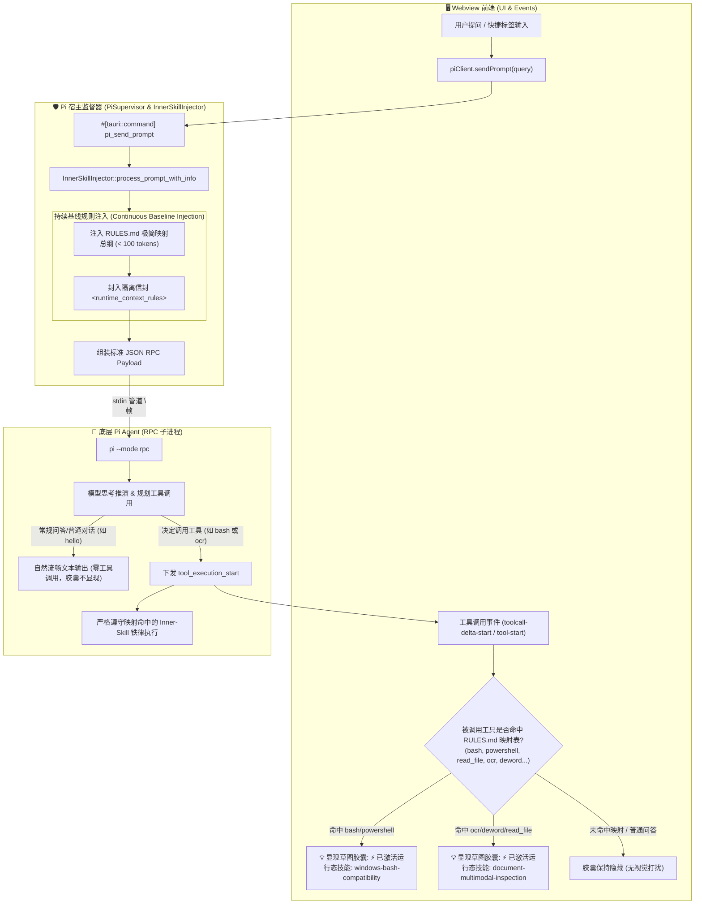

# 基于映射的运行态 Inner-Skills 上下文注入体系规范 (Mapping-Driven Inner-Skill Injection Architecture)

本规范定义了桌面应用（作为 **Pi Coding Agent** 的可视化宿主与监管代理）在运行时如何对底层 Agent 进行**基于映射按需注入、低 Token 损耗、高注意力保持且杜绝过拟合**的运行态上下文强行注入机制。

---

## 📌 核心开发原则：RULES 映射索引化，Skill 独立模块化，按需匹配精准注入

> ⚠️ **开发铁律（严格禁止直接在 RULES.md 堆砌具体规则）**：
> 1. **严禁在 `RULES.md` 中编写长篇具体的领域规则**：若把所有具体规则（终端语法、文档解析、网络安全等）直接塞在 `RULES.md` 中，会导致**每一轮对话无论是否调用工具都会全量注入**，引发严重的 Token 成本爆炸与大模型对话过拟合（Overfitting）；
> 2. **`RULES.md` 仅作为轻量级映射总纲 (Single Source of Truth Mapping Table)**：体积严格控制在 `< 100` Tokens，仅维护 Markdown 映射表格与极简的通用基线指令；
> 3. **所有具体规则必须独立封装为 Inner-Skill 模块**：每个特定领域的规则独立存放于 `src-tauri/inner-skills/<skill-name>/SKILL.md`；
> 4. **从规则矩阵命中之后再激活与注入**：由 Rust 引擎与前端监听器根据 `RULES.md` 的映射矩阵进行动态嗅探，**当且仅当底层 Agent 触发调用命中映射项的工具或意图时**，才精准激活对应 Skill 并呈现前端交互胶囊。

---

## 1. 为什么要通过映射注入？(Motivation & Background)

### ① 宿主角色定位：从“被动壳”到“主动监督与增强”
Pi Desktop Lite 不仅是 UI 渲染器，更扮演着 Pi Agent 的**可视化代理宿主（Host Proxy & Supervisor）**。桌面端拥有操作系统的真实感知（OS 平台、文件系统、进程生命周期），具备在消息下发链路中为模型动态赋能的能力。

### ② 传统全量静态注入的两难困境 (The Dilemma)
| 方案 | 致命缺陷 | 导致后果 |
| :--- | :--- | :--- |
| **仅首轮单次注入** | **注意力随多轮对话迅速衰减 (Attention Drift)** | 到第 3~5 轮长对话时，模型遗忘约束，重新犯错 |
| **每轮全量塞入所有 SKILL 详情 (1000+ Tokens)** | **Token 成本剧增 + 对话严重过拟合 (Overfitting)** | 哪怕用户只是打招呼或问普通概念，模型回答也充满警告和多余推演，语气生硬 |
| **✅ RULES 映射总纲 + 按需命中激活 (本项目方案)** | **每轮基线 < 100 Tokens，命中工具才激活对应 Skill 约束** | **Token 消耗极低、常规对话纯粹留白、工具调用精准约束零脱缰** |

---

## 2. 系统全链路拓扑结构 (System Topology & Dataflow)



---

## 3. 运行态 Inner-Skills 目录拓扑

所有运行态内置约束统一归档于 `src-tauri/inner-skills/`：

```text
src-tauri/inner-skills/
├── RULES.md                                  # 运行态映射总纲 (Single Source of Truth, < 100 Tokens)
├── windows-bash-compatibility/               # 独立 Skill 1: Windows 命令行与终端兼容规范
│   └── SKILL.md
└── document-multimodal-inspection/           # 独立 Skill 2: 多格式文档与目录深度遍历/OCR解析规范
    └── SKILL.md
```

---

## 4. 两阶段动态映射与触发体系 (Two-Phase Architecture)

### 4.1 阶段一：背景持续注入规则映射 (`RULES.md` Silent Baseline)
- **执行时机**：每轮用户发送 Prompt 或 FollowUp 时由 Rust 后端透明包装；
- **注入内容**：精炼纯英文 `<runtime_context_rules>`（`RULES.md` 原文，< 100 Tokens），包含工具到各个 Inner-Skill 的映射矩阵与轻量基线；
- **静默原则**：此阶段**不触发任何前端 UI 胶囊文本**，确保在用户仅打招呼（如 `hello`）或常规咨询时，界面保持纯粹纸质留白。

### 4.2 阶段二：即时工具拦截与技能激活呈现 (Just-In-Time Skill Feedback)
- **触发时机**：当且仅当底层 Pi Agent **决策并即将/正在调用映射工具时**；
- **事件捕获**：前端捕获 `toolcall-delta-start`、`tool-start` 与 `bash-update` 事件；
- **前端胶囊显现**：在 AI 思考卡片上方平滑淡入草图胶囊，展示当前命中的运行态技能名称；
- **生命周期自愈**：每次提交新提问（`resetStreamState`）时胶囊自动归零隐去，直到下一次有实际工具调用触发。

### 4.3 信封式隔离结构 (`<runtime_context_rules>`)
为彻底杜绝模型把上下文规则误当作“对话主题”而在回答中喋喋不休，所有注入内容必须严格使用 XML 标签信封包裹并附加作用域声明：

```text
<runtime_context_rules>
# Runtime Inner-Skills Mapping & Directive Rules

> Context Injection Rules for Host Agent Runtime.
> Applies ONLY when invoking tools. For standard conversational questions, greetings, or non-tool queries, respond directly and concisely without extra reasoning or tool execution planning. Do NOT alter normal response tone.

## 1. Tool-to-Skill Mapping Matrix

| Invoked Tool / Intent | Target Inner-Skill | Enforcement Level |
| :--- | :--- | :--- |
| `bash`, `terminal`, `powershell`, `cmd`, `execute_command` | `windows-bash-compatibility` | **Mandatory** |
| `read_file`, `docparser`, `ocr`, `deword`, `pi-ocr`, `pi-docparser`, `extract_text` | `document-multimodal-inspection` | **Mandatory** |

---

## 2. Mandatory Core Directives (Baseline)

When invoking tools or planning actions:
1. Terminal & CLI Execution (`windows-bash-compatibility`): Always use forward slashes '/'; quote paths; append auto-confirm (-y); disable pagers; NO_COLOR=1; forbid spontaneous file creation (e.g. output.txt).
2. Folder & Multi-Format Documents (`document-multimodal-inspection`): Proactively traverse directories; for .docx, .doc, .pdf, .pptx, .xlsx, or images, never read raw binary via cat; automatically invoke specialized parsers or OCR components (pi-ocr, deword, pi-docparser) to extract authentic text and tables; batch synthesize factual insights.
</runtime_context_rules>

用户原始提问内容
```

---

## 5. 🛠️ 新增 Inner-Skill 三步标准开发流水线 (Standard SOP)

当项目中需要针对新场景（如数据库操作、网络请求安全、代码审查等）新增运行态约束时，**必须严格按照以下三步执行，严禁直接把大段逻辑塞进 RULES.md**：

### Step 1: 建立独立的 Inner-Skill 模块目录与 `SKILL.md`
在 `src-tauri/inner-skills/<skill-name>/` 下创建 `SKILL.md`，使用标准结构编写详细执行铁律：
```markdown
---
name: your-new-skill-name
description: 简明扼要描述该运行态技能在何种场景下被触发与主要约束。
---

# 技能标题 (Inner Skill)

> ⚠️ 运行态约束说明：本 Skill 由桌面应用端在 Agent 触发相应工具时动态激活生效。

## 1. 核心铁律一
...
## 2. 核心铁律二
...
```

### Step 2: 在 `RULES.md` 的映射矩阵中注册
在 [`src-tauri/inner-skills/RULES.md`](file:///c:/Users/l4w/source/repos/pi-desktop-lite/src-tauri/inner-skills/RULES.md) 的 Markdown 表格中新增一行映射，并在基线部分补充一句话精炼指引：
```markdown
| `your_tool_1`, `your_tool_2`, `intent_keyword` | `your-new-skill-name` | **Mandatory** |
```

### Step 3: 后端内嵌与前端胶囊标签挂载
1. **Rust 后端 (`src-tauri/src/pi_runner/inner_skills.rs`)**：
   - 增加 `const EMBEDDED_YOUR_SKILL_MD: &str = include_str!("../../inner-skills/your-new-skill-name/SKILL.md");`；
   - 在 `get_skill_detail` 中添加该 Skill 的分支匹配；
   - 补充 `#[cfg(test)]` 单元测试断言。
2. **前端模块 (`src/modules/flow-pipeline.js`)**：
   - 在 `getSkillLabel` 中增加该 Skill 对应的中文友好标签（如 `⚡ 已激活运行态技能：your-new-skill-name (某某规范)`）。
3. **闭环验证**：
   - 运行 `npm run check` 确保前端 AST 检查与 Rust 编译零错误（Exit Code 0）。

---

## 6. 核心开发要点与避坑准则 (Key Precautions)

1. **`RULES.md` 为唯一事实来源 (Single Source of Truth)**：
   - 严禁在代码中写死某个工具的硬编码映射；工具到 Skill 的关联关系必须严格在 `src-tauri/inner-skills/RULES.md` 中维护，由引擎动态解析生效。
2. **命中映射才激活 (Trigger on Mapping Match Only)**：
   - 并非所有工具调用都显示胶囊，必须是被调用的工具在 `RULES.md` 矩阵中存在目标 Skill 时，才展示对应 Skill 激活提示。未映射工具（如普通辅助工具）绝不误触。
3. **Token 纯英文极简铁律**：
   - `RULES.md` 必须 100% 保持纯英文书写，严格将 Token 开销压制在最精炼级别，最大化节约每轮上下文预算。
4. **信封隔离与语气防护**：
   - 注入必须使用 `<runtime_context_rules>` 标签包裹，明确声明规则仅限工具调用阶段生效，并明确声明常规问答无需工具推演直接简明回复，防止模型在对话回答中生硬复述规则或过度思考。
5. **代码、文档与 Skill 三位一体同步**：
   - 每次新增或变更 Inner-Skill 时，必须同步对齐 `AGENTS.md`、`README.md` 与本技能文件，严禁文档滞后。
