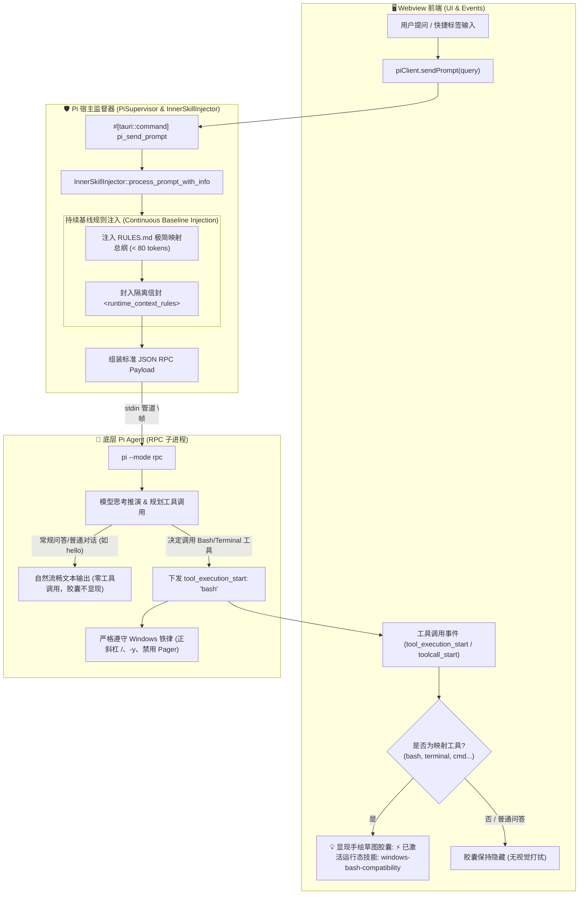

# 运行态 Inner-Skills 上下文强行注入体系规范 (Inner-Skills Context Injection)

本规范定义了桌面应用（作为 **Pi Coding Agent** 的可视化宿主与监管代理）在运行时如何对底层 Agent 进行**低 Token 损耗、高注意力保持且杜绝过拟合**的运行态上下文强行注入机制。

---

## 1. 为什么要注入？(Motivation & Background)

### ① 宿主角色定位：从“被动壳”到“主动监督与增强”
Pi Desktop Lite 不仅是 UI 渲染器，更扮演着 Pi Agent 的**可视化代理宿主（Host Proxy & Supervisor）**。桌面端拥有操作系统的真实感知（OS 平台、文件系统、进程生命周期），具备在消息下发链路中为模型动态赋能的能力。

### ② Windows 环境下的致命断层
Pi Agent 原生倾向于类 Unix/PTY 惯性，而在 Windows 环境下调用 Shell/终端工具时极易触发以下不可逆故障：
- **反斜杠路径转义截断**：`C:\repo\src\test` 中的 `\t`, `\r`, `\n` 被 JSON/字符串反转义为控制符，导致路径损坏；
- **交互式挂起死锁 (Anti-Hang)**：未带 `-y` 的包管理安装命令或带 Pager 的 `git log` 会永久等待键盘输入，导致进程卡死直至超时；
- **Linux 专属方言崩溃**：在 Windows 命令行中使用 `export VAR=val`、`rm -rf`、`touch` 等直接抛错；
- **控制台乱码与 ANSI 污染**：未声明 UTF-8 或携带颜色控制符导致输出解析异常。

### ③ 传统静态注入的两难困境 (The Dilemma)
| 方案 | 致命缺陷 | 导致后果 |
| :--- | :--- | :--- |
| **仅首轮单次注入** | **注意力随多轮对话迅速衰减 (Attention Drift)** | 到第 3~5 轮长对话时，模型遗忘 Windows 约束，重新犯错 |
| **每轮全量塞入 SKILL.md (800+ Tokens)** | **Token 成本剧增 + 对话严重过拟合 (Overfitting)** | 哪怕用户只是问“快速排序原理”，模型回答也充满 Bash 警告，语气僵硬 |

**核心诉求**：必须设计一套**高密度、纯英文、按需嗅探、周期衰减刷新、信封隔离**的智能动态注入体系。

---

## 2. 系统全链路拓扑结构 (System Topology & Dataflow)



---

## 3. 注入逻辑与两阶段触发体系 (Two-Phase Architecture)

### 3.1 阶段一：背景持续注入规则映射 (`RULES.md` Silent Baseline)
- **执行时机**：每轮用户发送 Prompt 或 FollowUp 时由 Rust 后端透明包装；
- **注入内容**：精炼纯英文 `<runtime_context_rules>`（< 80 Tokens），包含 `bash` / `terminal` / `powershell` 工具到 `windows-bash-compatibility` 的映射关系与 5 大基础约束；
- **静默原则**：此阶段**不触发任何前端 UI 胶囊文本**，确保在用户仅打招呼（如 `hello`）或常规咨询时，界面保持纯粹纸质留白。

### 3.2 阶段二：即时工具拦截与技能激活呈现 (Just-In-Time Skill Feedback)
- **触发时机**：当且仅当底层 Pi Agent **决策并即将/正在调用映射工具（如 `bash`、`terminal`、`powershell`）时**；
- **事件捕获**：前端捕获 `toolcall-delta-start`、`tool-start`（`toolName === "bash"`）或 `bash-update` 事件；
- **前端胶囊显现**：在 AI 思考卡片上方平滑淡入草图胶囊：
  `⚡ 已激活运行态技能：windows-bash-compatibility (Windows Shell 兼容规范)`；
- **生命周期自愈**：每次提交新提问（`resetStreamState`）时胶囊自动归零隐去，直到下一次有实际工具调用触发。

### 3.3 信封式隔离结构 (`<runtime_context_rules>`)
为彻底杜绝模型把上下文规则误当作“对话主题”而在回答中喋喋不休，所有注入内容必须严格使用 XML 标签信封包裹并附加作用域声明：

```text
<runtime_context_rules>
# Runtime Inner-Skills Mapping & Directive Rules
When invoking tool 'bash', 'terminal', 'powershell', 'cmd', 'execute_command':
1. Path Format: Always use forward slashes '/' for ALL file/directory paths (e.g. C:/repo/src). Never use raw '\'. Always quote paths with spaces.
2. Anti-Hang / Non-Interactive: Never execute commands that prompt for user input. Append auto-confirm flags (e.g. -y, --yes).
3. Disable Pagers: Never invoke pagers. Append --no-pager or prefix PAGER=cat / GIT_PAGER=cat.
4. Encoding & Clean Output: Prefix NO_COLOR=1. Ensure clean UTF-8 console output.
5. Cross-Platform Compatibility: Do NOT use 'export', 'rm -rf', 'touch', or trailing '&'.
(Note: This directive applies ONLY when invoking tools. Do NOT alter normal response tone.)
</runtime_context_rules>

用户原始提问内容
```

---

## 4. 实现方法与代码组织 (Implementation Anatomy)

### ① 规则定义层：`src-tauri/inner-skills/RULES.md`
- 采用极致精炼的纯英文 Markdown 书写；
- 明确建立 `bash` / `powershell` / `terminal` 工具到 `windows-bash-compatibility` 的直击映射。

### ② 注入引擎与映射解析层：`src-tauri/src/pi_runner/inner_skills.rs`
- 结构体 `InnerSkillInjector`：持有线程安全的 `AtomicUsize` 轮次计数器与 `SkillMapping` 映射索引表；
- **动态解析 `RULES.md`**：自动从 Markdown 表格解析 `| Invoked Tool / Intent | Target Inner-Skill |`，生成动态工具 ➔ Skill 映射索引；
- **直接注入 `RULES.md` 原文**：提供 `process_prompt_with_info(&self, message: &str)`，在每轮提问中封装 `<runtime_context_rules>` 并注入 `RULES.md` 原文；
- **动态查询接口**：提供 `resolve_skill_for_tool(&self, tool_name: &str) -> Option<String>` 与 `get_skill_mappings()`。

### ③ 监督管理与生命周期层：`src-tauri/src/pi_runner/supervisor.rs`
- `PiSupervisor` 统一持有 `Arc<InnerSkillInjector>`；
- `inject_prompt(&self, message: &str)` 负责下发前透明包装；
- 暴露 `pi_get_skill_mappings` 与 `pi_resolve_tool_skill` 命令供前端动态拉取；
- 在新建会话（`new_session`）、切换会话（`switch_session`）与重启宿主（`restart`）时主动调用 `reset_skill_turns()` 重置轮次。

### ④ 前端动态映射拦截与胶囊反馈：`src/modules/flow-pipeline.js`
- 启动时通过 `pi_get_skill_mappings` 从后端动态获取 `RULES.md` 的映射表；
- 监听 `toolcall-delta-start`、`tool-start` 与 `bash-update` 事件，**当且仅当被调用的工具命中 `RULES.md` 映射项时**（如 `bash` 命中 `windows-bash-compatibility`），即时平滑显现对应 Skill 胶囊；
- **未映射工具绝不误触**：若 Agent 调用未在 `RULES.md` 声明的工具（如 `read_file`、`web_search`），绝不显现胶囊；
- 提问提交 `resetStreamState` 时主动隐去胶囊，形成精准、零误触的视觉交互生命周期。

### ⑤ 手绘草图视觉层：`src/styles/flow.css` & `src/index.html`
- 容器结构：
  ```html
  <div class="flow-injection-capsule hidden" id="flow-injection-capsule" role="status" aria-live="polite">
    <span class="capsule-icon" aria-hidden="true"><svg>...</svg></span>
    <span class="capsule-text" id="flow-injection-text">...</span>
  </div>
  ```
- 遵循草图纸质美学：
  - 边框采用手绘虚线 `1px dashed var(--sketch-border-subtle)`；
  - 形状采用有机微不对称圆角 `border-radius: 255px 12px 225px 10px / 12px 225px 10px 255px;`；
  - 严格使用 CSS 变量（`var(--sketch-tag-bg)`, `var(--ink-muted)`），无缝适应系统明暗双模。

---

## 5. 核心开发要点与避坑准则 (Key Precautions)

1. **`RULES.md` 为唯一事实来源 (Single Source of Truth)**：
   - 严禁在代码中写死某个工具的硬编码映射；工具到 Skill 的关联关系必须严格在 `src-tauri/inner-skills/RULES.md` 中维护，由引擎动态解析生效。
2. **命中映射才激活 (Trigger on Mapping Match Only)**：
   - 并非所有工具调用都显示胶囊，必须是被调用的工具在 `RULES.md` 矩阵中存在目标 Skill 时，才展示对应 Skill 激活提示。
3. **Token 纯英文铁律**：
   - `RULES.md` 必须 100% 保持纯英文书写，最大化节约每轮上下文预算。
4. **信封隔离与语气防护**：
   - 注入必须使用 `<runtime_context_rules>` 标签包裹，明确声明规则仅限工具调用阶段生效，防止模型在对话回答中生硬复述规则。
5. **会话切换轮次清零**：
   - 切换或新建会话时必须重置轮次计数。

