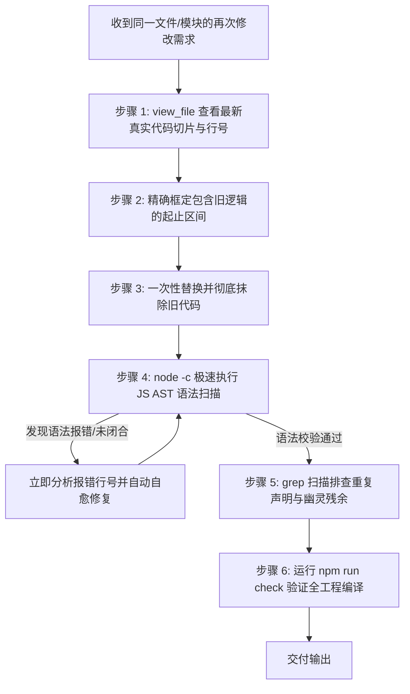

# 连续修改与迭代重构代码冗余清理规范 (Iterative Modification Hygiene)

在复杂任务的多次连续代码修改、分步重构与多轮打补丁过程中，极易因局部替换（Replace）范围偏差或逻辑迭代残留，产生**幽灵代码片段（Dangling Snippets）、未闭合语法结构、重复变量声明与僵尸事件监听**。

本 Skill 归档了在连续修改代码场景下的**四大高危病灶、黄金清理铁律、自动化语法门禁与标准自愈 SOP**。

---

## ⚠️ 一、多次修改代码的四大高危病灶

### 1. 幽灵函数头与未闭合残余 (Ghost Signatures & Dangling Syntax)
- **典型场景**：上一轮修改添加或修改了函数 `foo`，本轮修改在下方重写了 `foo`，但上一轮的 `const foo = (...) => {` 或部分语句未完全框入替换区间，残留无闭合大括号的代码碎片；
- **严重后果**：导致 JS 抽象语法树（AST）解析阻塞中断，桌面应用冷启动或模块加载直接白屏、卡死或无响应。

### 2. 标识符重复声明与变量遮蔽 (Duplicate Declarations)
- **典型场景**：多次迭代中在文件不同位置重复声明了同名的全局/模块级状态（如 `let currentThinkingText = ""` 或 `const renderedToolCards = new Map()`）；
- **严重后果**：引起 `Identifier 'xxx' has already been declared` 致命语法错误或运行时变量状态割裂。

### 3. 僵尸事件监听与旧通道残留 (Zombie Listeners & Stale Channels)
- **典型场景**：重构了组件交互流（如从单轮覆盖改造为多轮追加），但旧的全局 DOM 监听（如监听已废弃的 `#flow-user-text`）依然存在并持有旧指针；
- **严重后果**：触发双重响应、事件穿透或空指针异常（`Cannot read properties of null`）。

### 4. 孤儿 DOM 与失效 CSS 规则 (Orphaned Selectors)
- **典型场景**：JS 动态生成的 DOM 结构已升级为 `.flow-message-group`，但旧代码中残留对已销毁占位 ID 的直接操作。

---

## 🛡️ 二、连续修改的五大黄金清理铁律

### 铁律 1：修改前必须重新对齐真实行号与上下文 (View Before Replace)
**严禁凭历史记忆或上上轮对话中的行号直接下发替换指令。**
- 在对大文件（如 `main.js`）进行第二轮或后续修改前，**必须先使用 `view_file` 查看目标位置前后的真实代码切片**；
- 确认上一轮修改落地后的精确行号区间与闭合括号位置。

### 铁律 2：除旧布新必须原子化闭环 (Clean-as-you-go / Delete First)
- 当重构或升级某个方法/模块时，新逻辑的写入与旧逻辑的清理必须在**同一个替换事务中原子完成**；
- 严禁“先在文件末尾追加新函数，后续再考虑删旧函数”的做法；
- 替换区间必须完整包含旧函数定义及其相关的顶部注释、关联的临时标志位。

### 铁律 3：替换后必须执行精准排重扫描 (Duplicate Grep Check)
在完成涉及核心函数或状态的替换后，立即通过工具自检：
1. 搜索新函数/变量名在文件中的出现次数：
   ```bash
   # 检查是否存在重复声明（正常应仅 1 处声明）
   grep "const expandToolCard" src/main.js
   grep "let activeTurnRefs" src/main.js
   ```
2. 若命中次数 > 1（排除正常调用），必须立即介入排查是否产生了残留副本。

### 铁律 4：强制执行极速 AST 语法静态门禁 (Static AST Verification)
仅依靠 Rust 端的 `npm run check` 无法完全拦截 Web 前端未打包/原生 ES Module 脚本的运行时语法解析错误。
**修改 JavaScript 代码后，必须立即运行 Node.js 静态语法编译检查：**
```bash
# 静态 AST 检查（0.05秒极速完成，精确报错行号与未闭合语法）
node -c src/main.js
node -c src/services/task-manager.js
node -c src/services/conversation-history.js
```
若存在未闭合的 `{`、遗留函数头或语法错误，`node -c` 会以秒级速度直接输出语法错误堆栈，绝不让错误代码逃逸至用户运行时。

### 铁律 5：多轮历史重构的数据与事件幂等清理
当改造核心数据结构（如添加 `turns` 轮次数组）时：
- 检查旧数据兼容层：确保老数据迁移后，旧字段（如单值 `query` / `responseText`）与新数组字段保持同步或干净废弃，避免两套状态互锁；
- 检查缓存清理：必要时提供 LocalStorage / 缓存自愈逻辑，防止历史格式脏数据阻塞新代码。

---

## 📋 三、标准重构清理与自愈 SOP 流水线



---

## 💡 四、常见反模式与正向规范对照

| 反模式（容易引发卡死与幽灵代码） | 正向规范（干净、幂等、无残余） |
|---|---|
| ❌ 连续修改时只替换函数体内部，遗留未闭合的函数签名与旧大括号 | ✅ 替换时从 JSDoc 注释顶端一直包含到函数最外层末尾 `};`，整体原子化置换 |
| ❌ 在文件上方保留旧函数，在下方新增同名或别名函数以图省事 | ✅ 彻底搜索全工程，将旧实现完全删除并重构为统一调用点 |
| ❌ 修改完 JS 代码只跑 Rust 后端 `cargo check`，漏掉前端 AST 检查 | ✅ 立即并行运行 `node -c src/*.js`，确保前端脚本 100% 具备语法正确性 |
| ❌ 重命名变量后，未清理旧变量的初始化与事件监听 | ✅ 搜索旧变量名，清理所有死引用，确保零悬空监听器 |

---

## 📎 关联工具与检查命令

| 检查场景 | 推荐命令 | 作用 |
|---|---|---|
| **JS 语法与 AST 完整性** | `node -c <filePath>` | 静态解析 JS 文件语法，捕获未闭合括号与语法错误 |
| **重复声明与残余检索** | `grep_search` / `grep` | 搜索关键函数或变量的声明频率，杜绝重复声明 |
| **全工程集成编译校验** | `npm run check` | 联动 Rust 与前端构建环境，验证整体完整性 |
