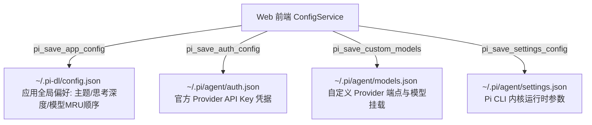

# 项目设置独立全屏页面工程规范与实现指南 (Settings View Pattern)

本项目将**项目设置与模型配置**设计为与 `detailed`（初始详细版）、`focus`（专注版）、`flow`（流式交互版）平级的**第 4 态独立全屏视图**。本指南详细规定设置界面的 DOM 结构、CSS 几何工程美学、Rust 双层持久化、MRU 自动排序、Token 规范吸附及交互闭环。

---

## 🏛️ 1. 架构总览与视图状态机 (View State Machine)

### 1.1 独立全页面而非弹出式浮窗
- 设置页面是宿主容器内的独立全屏舞台（`<section class="settings-view-stage" id="settings-view">`）；
- 通过根容器属性 `data-view="settings"` 进行显隐驱动，杜绝传统 Modal/Popup 引起的遮罩割裂与性能重绘问题；
- 记录 `previousView`，退出设置页时平滑恢复进入前的界面状态（如 Flow 对话或 Detailed 主页）。

```javascript
const VIEW_DETAILED = "detailed";
const VIEW_FOCUS = "focus";
const VIEW_FLOW = "flow";
const VIEW_SETTINGS = "settings";

let currentView = VIEW_DETAILED;
let previousView = VIEW_DETAILED;

const openSettingsView = async () => {
  if (currentView !== VIEW_SETTINGS) {
    previousView = currentView;
  }
  setViewMode(VIEW_SETTINGS, false);

  // 右上角指引 3 秒后平滑渐隐
  if (topbarHintBanner) {
    topbarHintBanner.classList.remove("fade-out");
    if (hintBannerTimeout) clearTimeout(hintBannerTimeout);
    hintBannerTimeout = setTimeout(() => {
      topbarHintBanner.classList.add("fade-out");
    }, 3000);
  }

  loadSessions();
  loadModelsAndState();
  loadOfficialProvidersConfig();
  loadCustomProvidersConfig();
};

const closeSettingsView = () => {
  if (currentView === VIEW_SETTINGS) {
    setViewMode(previousView || VIEW_DETAILED, true);
    return true;
  }
  return false;
};
```

---

## 🧭 2. 顶部导航与操作指引渐隐规范 (Topbar & Hint Banner)

### 2.1 消除左上角显式返回按钮
- 保持素描工程质感与极简线条，**全域去除左上角物理“返回主界面”按钮**；
- 严格由**鼠标右键**与 **Esc** 键统一分发“返回上一步/退出设置”；

### 2.2 右上角指引 3 秒平滑渐隐
- 右上角展示操作指引条（`<div class="topbar-hint-banner" id="topbar-hint-banner">`）：
  ```html
  <div class="topbar-hint-banner" id="topbar-hint-banner">
    <span class="hint-icon" aria-hidden="true">...</span>
    <span class="hint-text">提示：在任意位置点击 <strong>鼠标右键</strong> 或按 <strong>Esc</strong> 即可快速回退</span>
  </div>
  ```
- **CSS 平滑过渡规范**：
  ```css
  .topbar-hint-banner {
    display: flex;
    align-items: center;
    gap: 6px;
    background: transparent;
    border: 1px solid var(--sketch-border-subtle);
    border-radius: 4px;
    padding: 4px 10px;
    font-size: 11.5px;
    color: var(--ink-muted);
    white-space: nowrap;
    opacity: 1;
    visibility: visible;
    transition: opacity 0.6s ease, visibility 0.6s ease;
  }

  .topbar-hint-banner.fade-out {
    opacity: 0;
    visibility: hidden;
    pointer-events: none;
  }
  ```

---

## 💾 3. 双层持久化架构 (`~/.pi-dl/` 与 `~/.pi/agent/`)

本项目采用清晰的两层配置持久化设计：



### 3.1 第一层：桌面应用全局偏好 (`~/.pi-dl/config.json`)
- **文件路径**：`~/.pi-dl/config.json`（Windows 下为 `C:\Users\<username>\.pi-dl\config.json`）；
- **后端目录自愈**：若 `~/.pi-dl` 目录不存在，Rust 后端在读写时自动通过 `fs::create_dir_all` 递归新建；
- **持久化数据结构**：
  ```json
  {
    "theme": "system",
    "defaultThinkingLevel": "medium",
    "sendShortcut": "enter",
    "selectedModel": {
      "provider": "anthropic",
      "modelId": "claude-3-7-sonnet"
    },
    "modelWhitelist": [
      {
        "id": "claude-3-7-sonnet",
        "name": "Claude 3.7 Sonnet",
        "provider": "anthropic",
        "contextWindow": 200000,
        "maxTokens": 64000,
        "reasoning": true,
        "isCustom": false
      }
    ],
    "autoReconnectSwitch": true,
    "modelFailover": {
      "maxReconnectAttempts": 24,
      "reconnectBackoffMs": [2000, 4000, 8000],
      "maxBackoffMs": 8000,
      "perCandidateReconnectBudget": 2,
      "escalateToSwitchAfterReconnectExhausted": true,
      "switchOnPermanentError": true
    }
  }
  ```
- **`autoReconnectSwitch`（自动重连切换，默认 `true`）**：模型调用错误时是否进入全自动自愈流水线；缺失时默认勾选，变更时派发 `auto-reconnect-change` 事件同步设置页 Checkbox 与引擎；
- **`modelFailover`（模型自愈推荐参数块）**：`maxReconnectAttempts` 重连上限 24 次、`reconnectBackoffMs` 退避序列 2s/4s/8s、`maxBackoffMs` 恒封顶 8s、`perCandidateReconnectBudget` 单候选模型小额重连预算 2 次、`escalateToSwitchAfterReconnectExhausted` 重连耗尽默认升级为切换、`switchOnPermanentError` 永久错误自动切换模型；

### 3.2 第二层：Pi CLI 内核配置 (`~/.pi/agent/`)
- `auth.json`：持久化官方服务商（Anthropic, OpenAI, DeepSeek, Google, etc.）的 API Key；
- `models.json`：持久化两步式自定义服务商端点（Base URL、API Protocol、兼容 flags）与挂载模型；
- `settings.json`：持久化 Pi 命令行内核运行时配置；
- **模型自动重连推荐配置注入 (`pi_apply_model_failover_preset`)**：应用启动（自动重连开启时）与勾选「自动重连切换」时，向内核 `settings.json` 探测式写入 `retry.maxAttempts: 24` / `backoff: [2,4,8]` / `maxBackoffSeconds: 8`（best-effort，未知 schema 安全跳过、失败静默绝不报错），**已存在用户自定义 `retry` 配置时尊重原值不覆盖**；内核参数注入仅为辅助轨道，行为主实现由桌面 `ModelFailoverEngine` 保证「恰好 24 次 / 2-4-8s 退避」语义。

---

## 📋 4. 模型配置与折叠式通道抽屉规范 (Model Configuration & Channel Drawers)

### 4.1 5 大核心 Tab 导航结构
设置视图采用极简 5 大 Tab：
1. **常规 (`pane-appearance`)**
2. **模型配置 (`pane-current-models`)**：整合已添加模型列表与折叠式官方/自定义通道配置
3. **内核 (`pane-packages`)**：Pi 内核状态、一键热更新与扩展组件市场
4. **会话记录 (`pane-sessions`)**：内核全量会话检索与管理（详见 4.6 会话记录 Tab 规范）
5. **工作区 (`pane-workspaces`)**：多预设工作区模板→运行时副本切换（见 4.5）

### 4.2 模型列表展示与折叠式通道抽屉交互 (Drawer State Machine)
- **限高与滚动条**：模型列表容器限制 `max-height: 240px;` 并启用隐匿极简滚动条；
- **抽屉操作栏**：列表下方常设 `官方通道配置 - 展开` 与 `自定义通道配置 - 展开` 两个操作按钮，统一复用下拉框手绘 `ic_chevron_down.svg` 矢量微箭头；
- **多态折叠与无缝切换**：
  - 点击展开任一通道时，上方模型列表进入 `.collapsed-single` 模式（仅展示当前生效的选中项/第一项），为下方表单腾出空间；
  - 展开态下按钮文案变为 `收起`（箭头平滑旋转 180° 朝上）与目标通道切换按钮，支持在官方与自定义配置间自由一键直切；
  - 点击 `收起` 即可恢复多模型完整列表与初始展开按钮状态；
  - **大抽屉展开与局部表单智能定位流水线 (`scrollSettingsToBottom` & `scrollElementIntoViewBottom`)**：大通道抽屉首次展开或步骤切换时，调用 `scrollSettingsToBottom(true)` 平滑定位到底部；而在运营商卡片内部进行操作（如点击「+ 新增模型」、修改运营商配置、编辑模型参数或在线拉取更新推荐表单）时，统一调用 `scrollElementIntoViewBottom(targetElement, 24, true)` 智能平滑定位使得当前聚焦框体的底部对齐视口下边缘，彻底杜绝全页面无脑滚到底部导致上方操作区被顶出画面的问题。

### 4.3 界面元素与交互精简
- ❌ **去除刷新按钮**：模型状态与白名单由内部事件总线（`whitelist-change` / `model-change`）自驱动，无需手动刷新；
- ❌ **去除顶部“当前使用中”预览卡片**：避免信息重复与卡片堆叠；
- ❌ **去除鼠标拖拽与 6 点把手图标**：消除 `cursor: grab`、`draggable` 属性与拖拽虚线重绘。

### 4.4 最近选用顺序 (MRU - Most Recently Used) 算法与首位选中固定
- **第一行固定选中机制**：第一行（`index 0`）始终固定为当前正在激活选中的模型；
- **首位置顶生效**：当用户点击任一模型的“选用”按钮或通过 RPC 切换模型时，该模型自动移到列表首位（`index 0`）；
- **新增模型平滑追加**：新增或导入的模型默认插入在当前选中模型之后（`index 1`），绝不挤占首位当前选中模型；
- **激活锁定保护**：排在首位的当前使用中模型标注 `<span class="flat-badge flat-badge-active">使用中</span>`，删除按钮显示 `<button disabled><span class="btn-icon">...</span> 锁定</button>`，**严格禁止删除正在使用中的模型**；
- **即时持久化**：每次 MRU 顺序变更即时同步写入 `~/.pi-dl/config.json`。

```javascript
touchModelAsRecentlyUsed(provider, modelId) {
  if (!provider || !modelId) return;
  const list = [...this.loadModelWhitelist()];
  const index = list.findIndex(
    (m) =>
      m.id.toLowerCase() === modelId.toLowerCase() &&
      m.provider.toLowerCase() === provider.toLowerCase()
  );

  if (index > 0) {
    const [item] = list.splice(index, 1);
    list.unshift(item);
    this.saveModelWhitelist(list);
  }
}
```

### 4.5 模型配置「自动重连切换」Checkbox (Auto Reconnect Switch)
- **DOM 落点**：`.pane-header-row` 内「模型配置」标题（`<h3 class="pane-title">模型配置</h3>`）右侧；
- **样式铁律**：遵循手绘草图质感与按钮交互铁律——常态透明无边框、`1px solid transparent` 占位，`hover` / `focus-within` 才显手绘边框（`var(--sketch-border-subtle)`），杜绝 Layout Shift；视觉框 `1.2px solid var(--sketch-border-subtle)` + 不对称有机圆角，勾选时内显 `currentColor` 手绘对勾并填充墨色，150ms 平滑过渡，**严禁系统默认 Emoji 与原生复选样式**；
- **DOM 结构**（原生 `<input type="checkbox">` 视觉隐藏 + 自绘手绘框与对勾 SVG）：
  ```html
  <label class="auto-reconnect-toggle" title="模型调用失败时自动重连或切换其他模型">
    <input type="checkbox" class="auto-reconnect-checkbox" id="auto-reconnect-switch" checked autocomplete="off" />
    <span class="auto-reconnect-box" aria-hidden="true">
      <svg class="auto-reconnect-tick" viewBox="0 0 16 16" width="10" height="10" fill="none"
           stroke="currentColor" stroke-width="2" stroke-linecap="round" stroke-linejoin="round">
        <path d="M3 8.5 L6.5 12 L13 4.5" />
      </svg>
    </span>
    <span class="auto-reconnect-label">自动重连切换</span>
  </label>
  ```
- **交互绑定（`src/modules/kernel-panel.js`）**：加载时同步 `configService.getAutoReconnectSwitch()` 至 `checked`；`change` 时调用 `configService.setAutoReconnectSwitch(checked, true)`（持久化 + 引擎联动）；监听 `auto-reconnect-change` 事件双向同步 Checkbox；打开设置页（`loadModelsAndState`）时再次同步勾选状态；
- **默认状态**：**默认勾选（checked）**，缺失配置时按 `true` 处理；
### 4.6 模型白名单与官方/自定义通道状态联动同步 (Channel Drawer Synchronization)
- **双向感知铁律**：当在上方「当前模型列表」中点击「×」移除某个模型时，必须立即联动触发 `loadCustomProvidersConfig()` 与 `renderOfficialProviderDetails(...)`；
- **状态无缝复原**：移除后，下方官方通道或自定义通道内对应的模型项将实时重新计算 `configService.isModelInWhitelist(provider, modelId)`，其操作按钮从置灰的 `<button disabled>已添加</button>` 瞬间复原为可点击的 `<button>+ 添加到当前列表</button>`，彻底杜绝状态滞后；
- **抽屉展开按需刷新**：用户点击展开「官方通道配置」或「自定义通道配置」抽屉时，同样自动刷新该通道列表以呈现最新白名单状态。

### 4.7 工作区面板 (Workspace Panel)
- **Tab 落点**：设置页第 5 个 Tab —— `data-tab="tab-workspaces"` + `#pane-workspaces`；点击该 Tab 时通过 `api.loadWorkspaces()` 拉取并渲染（与 `tab-packages` 的按需加载模式一致），打开设置页时亦在 `openSettingsView` 中预热刷新；
- **DOM 结构**：
  1. **当前工作区卡片**（`.workspace-current-card`）：名称（`#workspace-active-name`）+ ID 徽章（`#workspace-active-badge`）+ 运行时绝对路径（`#workspace-active-path`，`title` 悬浮完整路径）；
  2. **预设工作区列表**（`#workspace-list`）：卡片式每项含名称、`id` 徽章、描述、已物化运行时路径、状态（「使用中」绿色墨徽章 /「切换」按钮）；
- **服务与模块划分**：
  - `src/services/workspace-service.js`：纯 IPC 封装 `pi_list_workspaces` / `pi_get_active_workspace` / `pi_set_active_workspace`，**不碰 DOM**；
  - `src/modules/workspace-panel.js`：渲染列表、切换交互、刷新 `ctx.settings.activeWorkspace`；
- **切换交互**：
  - 点击「切换」先调用 `piClient.getActiveTasks()`，当运行时任务数 > 0 时走 `sketchConfirm`（居中 / 毛玻璃 / 180ms 回弹 / 右键与 Esc 优先拦截）确认“仅对之后的新会话生效”；
  - 确认后调用 `pi_set_active_workspace(id)`，后端物化运行时副本（首次复制、已存在绝不覆盖）→ 持久化 `workspace.activeId` → 切换 → 主宿主空闲自动重启重锚 CWD；
  - 刷新列表与当前卡片，并按返回的 `activeTasks` / `restarted` 展示 Toast 提示；
- **样式铁律**：复用现有卡片 / 分组 / 徽章 / Flat 按钮 token，不新增色板；按钮常态透明无边框、悬浮显框；全图标内联 `currentColor` SVG，全域零 Emoji。

---

### 4.8 会话记录 Tab 规范 (Sessions Panel)

> **硬约束**：程序**不提供**任何直接删除 Pi 内核会话的功能/入口/命令；所有清空/隐藏操作仅作用于 UI 展示层，绝不触碰 `~/.pi` 下的内核会话 JSONL 文件。

- **数据源与工具栏**：`pi_list_sessions` 返回全量 `SessionMetadata`（后端按 `modified_at` 倒序），前端纯内存过滤零后端成本。`pane-header-row` 提供「清空界面会话」按钮（`#btn-clear-ui-sessions`），下方 `.sessions-toolbar` 一行容纳搜索框（`#sessions-search-input`，手绘盒式外观 + 200ms 防抖）与 SketchSelect 时间筛选（`#sessions-time-filter`，原生 `<select class="flat-select">` + `enhanceSelect`）；
- **过滤语义**：**硬过滤**——仅保留 `has_complete_turn = true` 的会话（Rust `parse_session_file` 逐行判定：存在至少一轮「剥离 `<runtime_context_rules>` 信封后非空的真实用户提问 → 后续 assistant 非空回答」；该标记同时使列表摘要净化为真实提问文本）；关键字命中 `first_message` / `session_id` / `cwd`（不区分大小写）；时间档位（全部/24h/7d/30d）按 `modified_at` 计算，解析失败的记录视为不匹配非「全部时间」档；过滤状态（keyword/timeRange）持久于 `sessions-panel.js` 模块级变量，`pi:sessions-updated` 事件重渲染时保留；空态区分「暂无历史会话」与「无匹配会话」；计数显示过滤后数量（如 `12/34`），无过滤时显示总数；
- **统一进入管线 (`enterKernelSessionFlow`)**：会话条目左键点击与「进入 Flow」按钮走同一条管线（按钮带 loading 态防重复触发）：
  1. 若 TaskManager 存在活跃任务，先 `api.archiveCurrentFlowToHistory()` 归档当前 Flow 现场（防覆盖）；
  2. `sessionService.getSessionDetail(path)` → Rust `pi_get_session_detail`（`parse_session_turns` 按 user/assistant/toolResult 顺序配对，剥离 `<runtime_context_rules>` 信封与「[附带本地文件绝对路径]」尾注，thinking/toolCall 块逐字段防御解析，超长工具结果截断 4000 字符）；
  3. `conversationHistoryService.recordConversation({ id: "kernel_" + session_id, ... })` 以 `kernel_` 前缀隔离沉淀界面1 讯息卡片（自带 MRU 刷新 + 反隐藏，受 60 条上限约束）；
  4. 绑定/复用 TaskManager Task（id = convId），经共享渲染器 `api.renderTurnsIntoFlow(task, turns)` 还原 Flow 多轮（思考卡收起、工具卡默认折叠、滚动到底）并切换内核会话（`pi_switch_session`）；
  5. 解析失败降级：仅渲染首条提问空轮次 + `sketchAlert` 提示；
  6. 直接 `setViewMode(VIEW_FLOW)`，**不调用** `closeSettingsView()`（避免先跳回 previous 的中间态抖动）；
- **清空语义 (F2)**：「清空界面会话」→ `sketchConfirm`（isDanger）二次确认（文案明示「仅影响界面展示，不会删除 Pi 内核会话文件」）→ `conversationHistoryService.clearAllConversations()`（清内存 + 删除 `pi_conversation_history` 与 `pi_hidden_conversation_ids` 两键 + 广播 `conversations-change`）→ toast「已清空界面会话记录」；
- **右键回退特例 (`flowFromSettings`)**：进入 Flow 时置 `view.flowFromSettings = true`；Flow 中右键/Esc 时空闲/已结束态 → 清标志、不挂起不归档、`openSettingsView("sessions", { previousMode: VIEW_DETAILED })` 定向回设置页会话记录 Tab（Flow 现场保留，再右键照常回界面1）；运行/暂停态 → 清标志后走正常挂起通道；`setViewMode` 对任何离开 Flow 的路径兜底清标志；
- **历史渲染去重**：Flow 轮次渲染统一收敛至 `task-panel.js` 共享函数 `renderTurnsIntoFlow(task, turns, { isRunning, syncModelName, sessionPath })`，`restoreTaskToFlow` / `restoreConversationToFlow` / `enterKernelSessionFlow` 三者共用，禁止再各自内联渲染循环。

## 🎯 5. 自定义模型配置与 Token 规范智能吸附 (Token Snapping)

### 5.0 两步式配置与保存自动跳转 (Step 1 ➔ Step 2)
- **步骤 1（新增/配置运营商）**：填写运营商标识、接口类型、Base URL、Key 与兼容性开关；
- **保存自动切换**：点击「+ 保存/更新运营商」保存成功后，全自动切换至「步骤 2（运营商列表与模型管理）」（调用 `switchInnerTab("inner-step2")`），并刷新卡片列表、平滑滚动到底部，方便用户直接为该运营商添加具体模型或进行管理；

### 5.1 思考推理默认勾选
- 在自定义运营商下点击“+ 新增模型”展开行内表单时，“**支持思考/推理**”复选框必须默认勾选：
  ```html
  <label class="checkbox-label">
    <input type="checkbox" class="input-new-reasoning" checked />
    <span>支持思考/推理</span>
  </label>
  ```

### 5.2 输出上限标准 Token 智能吸附 (Canonical Snapping)
- 大模型主流输出上限具备标准档位规范：
  `[512, 1024, 2048, 4096, 8192, 16384, 32768, 64000, 65536, 100000, 128000, 131072]`
- **交互行为**：
  - 用户在新增或编辑模型的“输出上限 (Tokens)”输入任意数字（如 `3000`、`50000`）；
  - 当触发 **Enter 回车**、**失焦 (blur)**、**内容变更 (change)** 或 **点击保存** 时，自动计算并吸附到最接近的规范值（如 `3000` ➔ `4096`，`50000` ➔ `64000` / `65536`）。

```javascript
const STANDARD_OUTPUT_TOKENS = [
  512, 1024, 2048, 4096, 8192, 16384, 32768, 64000, 65536, 100000, 128000, 131072,
];

const snapToClosestStandardTokens = (inputVal) => {
  let num = parseInt(inputVal, 10);
  if (isNaN(num) || num <= 0) return 4096;

  let closest = STANDARD_OUTPUT_TOKENS[0];
  let minDiff = Math.abs(num - closest);

  for (const val of STANDARD_OUTPUT_TOKENS) {
    const diff = Math.abs(num - val);
    if (diff < minDiff) {
      minDiff = diff;
      closest = val;
    }
  }
  return closest;
};

const setupOutputTokensAutoSnap = (inputEl) => {
  if (!inputEl) return;
  const doSnap = () => {
    if (inputEl.value && inputEl.value.trim() !== "") {
      const snapped = snapToClosestStandardTokens(inputEl.value);
      inputEl.value = snapped.toString();
    }
  };
  inputEl.addEventListener("blur", doSnap);
  inputEl.addEventListener("change", doSnap);
  inputEl.addEventListener("keydown", (e) => {
    if (e.key === "Enter") {
      e.preventDefault();
      doSnap();
      inputEl.blur();
    }
  });
};
```

### 5.3 手绘草图质感自定义填表与智能联想规范 (Sketch AutoFill)
- 表单输入框严禁使用浏览器原生 Autofill / Autocomplete 弹窗；
- 全量 `<input>` 必须声明 `autocomplete="off"`、`autocorrect="off"`、`autocapitalize="off"`、`spellcheck="false"`；
- 关键表单输入框通过 `enhanceInputAutoFill`（位于 `src/services/sketch-autofill.js`）挂载手绘联想浮层（支持运营商/模型/URL预设与历史记忆池，实现全表字段智能联动填充）；
- 动态卡片创建完毕后必须调用 `enhanceAllAutoFills(container)`；
- 完整开发规范与示例详见专用技能：[`sketch-form-autofill-pattern`](file:///.agents/skills/sketch-form-autofill-pattern/SKILL.md)。

### 5.4 新增模型「获取模型列表」与按运营商隔离表单记忆 (Provider-Scoped AutoFill & Remote Fetching)
- **在线模型列表拉取**：在自定义运营商的「+ 新增模型」表单头部集成手绘「获取模型列表」按钮（`btn-fetch-custom-models`），点击调用 `configService.fetchCustomProviderModels({ providerId, baseUrl, apiKey, apiType })`；
- **全表字段覆盖填入 (Form Overwrite & Token Snapping)**：拉取成功后动态调用 `inputElement.__sketchAutoFill.updatePresets(formattedList, title)`，更新并立即弹出手绘推荐浮层供用户选择；点击任一模型时覆盖填入 Model ID、Display Name、Context Window、Max Tokens（自动触发 Token 智能吸附）与 Reasoning 开关；
- **运营商专属记忆隔离 (Provider Memory Isolation)**：不同运营商的表单预设与填表历史严格跟随运营商本身（`type: model:<provider_id>`），确保 SiliconFlow、Ollama、OneAPI 或用户自建网关的历史记录与预设库互不干扰并持久化保存。

---

## 🎨 6. 视觉设计与 CSS 几何工程铁律 (Engineering Aesthetics)

1. **配色统一与低饱和度**：完全继承主界面纸质微渐变与墨水变量，严禁使用鲜艳刺眼的亮色，功能标识（Badge）使用低饱和度色调；
2. **非嵌套纯净线框**：
   - 杜绝多层卡片阴影嵌套（Card-in-card Shading）；
   - 外层统一采用 `1px solid var(--sketch-border-subtle)`（静止态）与 `1px solid var(--sketch-border)`（聚焦态）；
   - 内部子卡片与表单输入控件统一采用透明底色（`background: transparent`）；
3. **按钮悬浮显框（常态透明）**：
   - 常态：`background: transparent; border: 1px solid transparent;` 保持 1px 几何占位；
   - 悬浮：`:hover { border-color: var(--sketch-border-subtle); background: var(--sketch-tag-bg); }` 绝不引起 Layout Shift；
4. **手绘矢量图标**：全量使用手绘内联 SVG（`src/assets/svg/`），使用 `currentColor` 自适应明暗双模。

---

## 🧩 7. 内核与扩展组件管理规范 (Package Catalog & Kernel Runtime Pattern)

- **内核顶部状态卡片与一键热更新**：在面板顶部展示底层 Pi 内核进程状态（Ready / Starting / Stopped / Crashed）、版本号、一键重启内核、检查更新与**一键内核热更新**（支持流式下载进度条与 Changelog 折叠预览抽屉）；
- **连通官方目录**：通过 Rust `package_manager` 模块异步抓取 `pi.dev/packages`，基于正则提取 `data-package-*` 属性，设置 15min TTL 内存缓存；
- **已安装组件折叠面板与智能配置预设 (Package Presets Pattern)**：
  - 读取 `~/.pi/agent/settings.json` 与 `node_modules` 探测本地包名与版本，提供批量检查更新、单包更新与卸载能力；
  - **插件默认配置预设映射**：二进制内嵌 `package-presets.json`，安装时自动应用推荐配置（如 `pi-web-access` 静默后台搜索与禁用弹窗）；
  - **动态「推荐配置」按钮**：对存在映射但本地未生效的组件，在卡片右上角卸载按钮左侧显现「推荐配置」手绘线框按钮，支持手动一键应用与校验；
  - **推荐插件内嵌与一键安装 (`recommended-plugins.json`)**：二进制内嵌 `recommended-plugins.json`（含 `pi-subagents`、`pi-web-access`、`pi-docparser`、`deword`、`@quintinshaw/pi-dynamic-workflows`、`pi-memory`、`pi-ocr`），在「检查组件更新」按钮左侧动态展示「安装推荐插件」按钮；点击后过滤跳过已安装项，批量加入 FIFO 队列自动逐一安装；当所有推荐插件均已安装时，按钮自动隐藏；
- **手绘进度条与平滑步进引擎 (ProgressStepper Engine)**：
  - 内核更新与扩展组件安装/更新/卸载接入 `ProgressStepper` 引擎；
  - **阶段百分比平滑步进**：当位于某阶段百分比（如 15%）时，立即跳至该百分比；在等待期间每隔 2 秒自动增加 1%，直到 `(下个阶段 - 1)%`（例如下个阶段为 35%，则伪百分比最多增长至 34% 停止）；
  - **即时响应跳变**：触发下个阶段后（如 35%），立即跳至 35%，并以该阶段继续平滑步进；到达 100% 或终态（`completed` / `uninstalled` / `error` / `cancelled`）时立即停止定时器；
  - 提供卡片内置微进度条（`.card-progress-wrap`）与右下角手绘浮动进度卡（`.package-progress-float-card`），搭配动态斜纹（`sketchStripesMove`）与平滑退出动效；
- **非阻塞 CLI 桥接**：执行 `pi install/remove npm:<pkg> -a` 必须附带 `-a` (`--approve`) 保证非交互执行。

---

## 📜 7.5 会话记录面板规范 (Sessions History Panel Pattern)

- **高度 100% 自动匹配当前框体**：`#pane-sessions.tab-pane.active` 采用 `flex: 1; height: 100%; min-height: 0; display: flex; flex-direction: column; gap: 0;`，其内部 `.sessions-list` 设置 `flex: 1; min-height: 0; max-height: none; overflow-y: auto;`，彻底摒弃写死高度，自适应窗口缩放与拉伸；
- **会话条目精细外观 (Session Item Aesthetics)**：
  - **语义化标题与摘要**：优先提取用户首条提问内容作为主标题（超长自动截断并在 tooltip 呈现完整内容），副行两行优雅展现多行提问摘要；
  - **多维手绘元数据标签 (Meta Pills)**：展示消息条数徽标（如 `3 条消息`）、工作区所属文件夹（带手绘文件夹图标 `ICONS.folder`）与会话 ID 短码（如 `#a1b2c3`）；
  - **整卡点击与悬浮响应动效**：卡片本身点击即可直接进入 Flow；常态下消除独立按钮以保持极简留白；鼠标悬浮（`:hover`）或键盘聚焦时右下角平滑浮现「进入 Flow →」文本，且右箭头触发 `arrow-wiggle-right` 向右微抖动动效（Task Flow 侧边栏卡片保持同款一致规范）；
  - **手绘空状态**：无会话或搜索无匹配时展示手绘素描对话气泡与居中温和提示。

---

## 🔄 8. 全域右键与键盘回退集成 (Step Back Pipeline)

所有设置页面必须注册到全局 `window.__piRegisterStepBack`：

```javascript
// 注册设置页面回退处理器
registerStepBackHandler(() => {
  return closeSettingsView();
});

// 监听 Escape 键
window.addEventListener("keydown", (e) => {
  if (e.key === "Escape") {
    if (currentView === VIEW_SETTINGS) {
      closeSettingsView();
    }
  }
});
```

---

## ✅ 9. 交付检查清单 (Pre-Ship Checklist)

- [ ] **返回按钮**：左上角无物理“返回主界面”按钮，右键与 Esc 均可瞬间平滑退出？
- [ ] **指引渐隐**：右上角提示条在进入设置 3 秒后通过 CSS 自动平滑渐隐？再次进入可重新触发？
- [ ] **持久化检查**：在 `~/.pi-dl/config.json` 中完整持久化主题、思考深度、选用模型及 MRU 顺序？目录缺失时 Rust 可自动创建？
- [ ] **MRU 排序**：选用任意模型自动移到列表首位生效？当前使用中的模型锁定禁止删除？无拖拽把手图标与 grab 手势？
- [ ] **Token 吸附**：新增模型时思考推理默认勾选？输入任意输出上限数字在回车、失焦或保存时自动吸附至规范值？
- [ ] **扩展组件市场**：支持组件搜索筛选、已安装列表折叠管理、一键安装、更新比对与卸载？
- [ ] **编译验证**：执行 `cargo check` 与 `npm run build:check` 均为 Exit Code 0？
