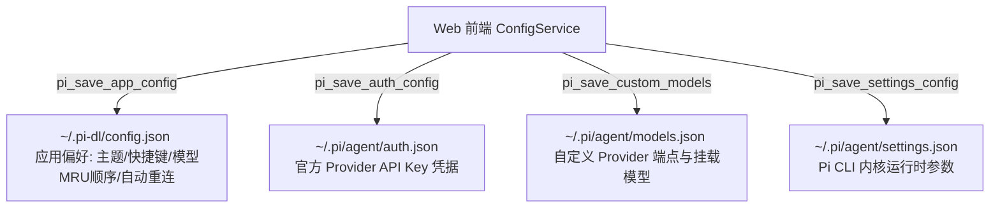

# 项目设置独立全屏页面工程规范 (Settings View Pattern)

规范将项目设置与模型配置设计为与 `detailed`、`focus`、`flow` 平级的**第 4 态独立全屏视图**（`data-view="settings"`）的工程实现与交互范式。

---

## 🏛️ 1. 视图状态机与顶部指引

```text
Detailed / Focus / Flow ──(点击齿轮设置)──> Settings View (记录 previousView)
Settings View ──(鼠标右键 / Esc)──> 退出并平滑恢复 previousView
```

- **非浮窗全屏舞台**：通过 `<section class="settings-view-stage" id="settings-view">` 承载，杜绝 Modal 遮罩割裂与性能重绘；
- **全域消除物理返回按钮**：全域由鼠标右键与 Esc 键统一分发回退；
- **右上角指引 3 秒渐隐**：进入设置页后，操作指引条（`topbar-hint-banner`）在 3 秒后通过 CSS `opacity: 0; visibility: hidden;` 平滑渐隐。

---

## 💾 2. 双层持久化架构



### 应用全局配置 (`~/.pi-dl/config.json`)
- `autoReconnectSwitch`（默认 `true`）：模型调用报错时进入自动重连切换流水线；
- `modelFailover`：`maxReconnectAttempts: 24`，退避序列 `[2000, 4000, 8000]`，单候选重连预算 2 次；
- **内核辅助注入**：启动与勾选时通过 `pi_apply_model_failover_preset` 探测式写入 `settings.json`（已存在自定义配置时不覆盖）。

---

## 📋 3. 5 大核心 Tab 导航规范

### 1. 常规 (`pane-appearance`)
主题切换（系统/浅色/深色）、思考深度（Thinking Level）、发送快捷键（`Enter` / `Ctrl+Enter`）。

### 2. 模型配置 (`pane-current-models`)
- **MRU 自动排序与首位锁定**：首位（`index 0`）始终固定为当前选中模型，锁定禁止删除；点击任一模型选用立即移至首位；新增模型插入至 `index 1`；
- **子代理模型自动钉住 (`pi-subagents`)**：选用模型时若检测到已安装 `pi-subagents` 扩展，自动调用 `pi_sync_subagent_pinned_model` 将当前主模型锁定为子代理默认模型与各角色 overrides，防止高阶思维模型跃升；
- **折叠式通道抽屉**：列表限高 240px，展开抽屉时模型列表进入 `.collapsed-single`（仅留选中项），表单聚焦时调用 `scrollElementIntoViewBottom` 智能对齐视口下缘；
- **自动重连切换 Checkbox**：标题右侧集成手绘草图复选框，常态透明无边框（`1px transparent` 占位），`hover` 显边框。

### 3. 内核与扩展管理 (`pane-packages`)
- **内核监控与热更新**：顶部展示内核状态（Ready/Starting/Stopped/Crashed），支持一键重启与流式下载热更新；
- **包市场与预设**：连通 `pi.dev/packages`（15min TTL 缓存），支持一键安装推荐插件（`recommended-plugins.json`）与推荐配置应用（`presets.json`）；
- **ProgressStepper**：平滑步进引擎驱动阶段百分比与斜纹动效。

### 4. 会话记录 (`pane-sessions`)
- **前端内存过滤**：硬过滤仅保留 `has_complete_turn = true` 的有效会话，支持 200ms 防抖搜索与时间档位筛选；
- **进入 Flow 管线 (`enterKernelSessionFlow`)**：原生深度剥离注入信封与附件绝对路径尾注，还原多轮对话并直通 Flow（置 `view.flowFromSettings = true`，空闲态右键/Esc 定向回退设置页会话 Tab）；
- **清空规则**：「清空界面会话」经 `sketchConfirm` 二次确认后仅清空 UI 记录，**绝不删除磁盘内核 JSONL 文件**。

### 5. 工作区 (`pane-workspaces`)
- **双轨物化**：内置模板只读，首次选中复制到 `~/.pi-dl/workspaces/<id>/` 作为运行时副本；
- **`code-area` 路由中枢**：物理 CWD 在 `code-area`，绑定目标项目绝对路径；原生 Windows 文件夹选择器（`rfd`）；存在性自动校验与失效清理；免污染铁律；对话透明注入目标项目 `AGENTS.md` / `README.md` 与技能清单。

---

## 🎯 4. 自定义模型 Token 规范智能吸附 (Canonical Snapping)

标准档位集合：`[512, 1024, 2048, 4096, 8192, 16384, 32768, 64000, 65536, 100000, 128000, 131072]`。

```javascript
const STANDARD_OUTPUT_TOKENS = [512, 1024, 2048, 4096, 8192, 16384, 32768, 64000, 65536, 100000, 128000, 131072];

export const snapToClosestStandardTokens = (inputVal) => {
  let num = parseInt(inputVal, 10);
  if (isNaN(num) || num <= 0) return 4096;
  return STANDARD_OUTPUT_TOKENS.reduce((prev, curr) =>
    Math.abs(curr - num) < Math.abs(prev - num) ? curr : prev
  );
};
```
在输入框 `blur`、`change`、`Enter` 或点击保存时自动吸附至最接近的标准档位（如 `3000` ➔ `4096`，`50000` ➔ `64000`）。

---

## 🎨 5. 几何工程美学与回退接入

1. **按钮规范**：常态背景透明、`1px transparent` 边框占位，悬浮（`:hover`）显手绘边框；
2. **纯净线框**：外层 `1px solid var(--sketch-border-subtle)`，子卡片与输入控件背景透明；
3. **Step Back 注册**：
```javascript
registerStepBackHandler(() => closeSettingsView());
window.addEventListener("keydown", (e) => {
  if (e.key === "Escape" && currentView === VIEW_SETTINGS) closeSettingsView();
});
```

---

## 📋 交付核查清单

- [ ] 视图通过 `data-view="settings"` 驱动，无物理返回按钮；
- [ ] 右上角指引 3 秒后通过 CSS 自动平滑渐隐；
- [ ] `~/.pi-dl/config.json` 与 `~/.pi/agent/` 双层持久化正确读写；
- [ ] 模型选用自动移至首位生效，当前使用中模型锁定保护；
- [ ] 输出上限数字触发自动吸附至标准 Token 档位；
- [ ] 会话记录与工作区面板交互符合免污染与零文件删除原则。
