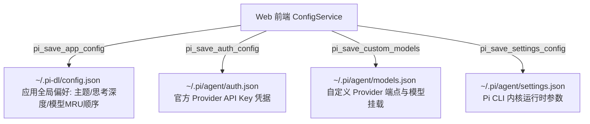

# 项目设置独立全屏页面工程规范与实现指南 (Settings View Pattern)

本项目将**项目设置与模型配置**设计为与 `detailed`（初始详细版）、`focus`（专注版）、`flow`（流式交互版）平级的**第 4 态独立全屏视图**。本指南详细规定设置界面的 DOM 结构、CSS 几何工程美学、Rust 双层持久化、MRU 自动排序、Token 规范吸附及交互闭环。

---

## 🏛️ 1. 架构总览与视图状态机 (View State Machine)

### 1.1 独立全页面而非弹出式浮窗
- 设置页面是宿主容器内的独立全屏舞台（`<section class="settings-view-stage" id="settings-view">`）；
- 通过根容器属性 `data-view="settings"` 进行显隐驱动，杜绝传统 Modal/Popup 引起的遮罩割裂与性能重绘问题；
- 记录 `previousView`，退出设置页时平滑恢复进入前的界面状态（如 Flow 对话或 Detailed 主页）。

```javascript
const VIEW_DETAILED = "detailed";
const VIEW_FOCUS = "focus";
const VIEW_FLOW = "flow";
const VIEW_SETTINGS = "settings";

let currentView = VIEW_DETAILED;
let previousView = VIEW_DETAILED;

const openSettingsView = async () => {
  if (currentView !== VIEW_SETTINGS) {
    previousView = currentView;
  }
  setViewMode(VIEW_SETTINGS, false);

  // 右上角指引 3 秒后平滑渐隐
  if (topbarHintBanner) {
    topbarHintBanner.classList.remove("fade-out");
    if (hintBannerTimeout) clearTimeout(hintBannerTimeout);
    hintBannerTimeout = setTimeout(() => {
      topbarHintBanner.classList.add("fade-out");
    }, 3000);
  }

  loadSessions();
  loadModelsAndState();
  loadOfficialProvidersConfig();
  loadCustomProvidersConfig();
};

const closeSettingsView = () => {
  if (currentView === VIEW_SETTINGS) {
    setViewMode(previousView || VIEW_DETAILED, true);
    return true;
  }
  return false;
};
```

---

## 🧭 2. 顶部导航与操作指引渐隐规范 (Topbar & Hint Banner)

### 2.1 消除左上角显式返回按钮
- 保持素描工程质感与极简线条，**全域去除左上角物理“返回主界面”按钮**；
- 严格由**鼠标右键**与 **Esc** 键统一分发“返回上一步/退出设置”；

### 2.2 右上角指引 3 秒平滑渐隐
- 右上角展示操作指引条（`<div class="topbar-hint-banner" id="topbar-hint-banner">`）：
  ```html
  <div class="topbar-hint-banner" id="topbar-hint-banner">
    <span class="hint-icon" aria-hidden="true">...</span>
    <span class="hint-text">提示：在任意位置点击 <strong>鼠标右键</strong> 或按 <strong>Esc</strong> 即可快速回退</span>
  </div>
  ```
- **CSS 平滑过渡规范**：
  ```css
  .topbar-hint-banner {
    display: flex;
    align-items: center;
    gap: 6px;
    background: transparent;
    border: 1px solid var(--sketch-border-subtle);
    border-radius: 4px;
    padding: 4px 10px;
    font-size: 11.5px;
    color: var(--ink-muted);
    white-space: nowrap;
    opacity: 1;
    visibility: visible;
    transition: opacity 0.6s ease, visibility 0.6s ease;
  }

  .topbar-hint-banner.fade-out {
    opacity: 0;
    visibility: hidden;
    pointer-events: none;
  }
  ```

---

## 💾 3. 双层持久化架构 (`~/.pi-dl/` 与 `~/.pi/agent/`)

本项目采用清晰的两层配置持久化设计：



### 3.1 第一层：桌面应用全局偏好 (`~/.pi-dl/config.json`)
- **文件路径**：`~/.pi-dl/config.json`（Windows 下为 `C:\Users\<username>\.pi-dl\config.json`）；
- **后端目录自愈**：若 `~/.pi-dl` 目录不存在，Rust 后端在读写时自动通过 `fs::create_dir_all` 递归新建；
- **持久化数据结构**：
  ```json
  {
    "theme": "system",
    "defaultThinkingLevel": "medium",
    "selectedModel": {
      "provider": "anthropic",
      "modelId": "claude-3-7-sonnet"
    },
    "modelWhitelist": [
      {
        "id": "claude-3-7-sonnet",
        "name": "Claude 3.7 Sonnet",
        "provider": "anthropic",
        "contextWindow": 200000,
        "maxTokens": 64000,
        "reasoning": true,
        "isCustom": false
      }
    ]
  }
  ```

### 3.2 第二层：Pi CLI 内核配置 (`~/.pi/agent/`)
- `auth.json`：持久化官方服务商（Anthropic, OpenAI, DeepSeek, Google, etc.）的 API Key；
- `models.json`：持久化两步式自定义服务商端点（Base URL、API Protocol、兼容 flags）与挂载模型；
- `settings.json`：持久化 Pi 命令行内核运行时配置。

---

## 📋 4. 当前模型列表规范 (MRU 自动排序与激活锁定)

### 4.1 界面元素与交互精简
- ❌ **去除刷新按钮**：模型状态与白名单由内部事件总线（`whitelist-change` / `model-change`）自驱动，无需手动刷新；
- ❌ **去除顶部“当前使用中”预览卡片**：避免信息重复与卡片堆叠；
- ❌ **去除鼠标拖拽与 6 点把手图标**：消除 `cursor: grab`、`draggable` 属性与拖拽虚线重绘。

### 4.2 最近选用顺序 (MRU - Most Recently Used) 算法
- **首位置顶机制**：当用户点击任一模型的“选用”按钮、通过 RPC 切换模型或添加新模型时，该模型自动移到列表首位（`index 0`）；
- **激活锁定保护**：排在首位的当前使用中模型标注 `<span class="flat-badge flat-badge-active">使用中</span>`，删除按钮显示 `<button disabled><span class="btn-icon">...</span> 锁定</button>`，**严格禁止删除正在使用中的模型**；
- **即时持久化**：每次 MRU 顺序变更即时同步写入 `~/.pi-dl/config.json`。

```javascript
touchModelAsRecentlyUsed(provider, modelId) {
  if (!provider || !modelId) return;
  const list = [...this.loadModelWhitelist()];
  const index = list.findIndex(
    (m) =>
      m.id.toLowerCase() === modelId.toLowerCase() &&
      m.provider.toLowerCase() === provider.toLowerCase()
  );

  if (index > 0) {
    const [item] = list.splice(index, 1);
    list.unshift(item);
    this.saveModelWhitelist(list);
  }
}
```

---

## 🎯 5. 自定义模型配置与 Token 规范智能吸附 (Token Snapping)

### 5.1 思考推理默认勾选
- 在自定义运营商下点击“+ 新增模型”展开行内表单时，“**支持思考/推理**”复选框必须默认勾选：
  ```html
  <label class="checkbox-label">
    <input type="checkbox" class="input-new-reasoning" checked />
    <span>支持思考/推理</span>
  </label>
  ```

### 5.2 输出上限标准 Token 智能吸附 (Canonical Snapping)
- 大模型主流输出上限具备标准档位规范：
  `[512, 1024, 2048, 4096, 8192, 16384, 32768, 64000, 65536, 100000, 128000, 131072]`
- **交互行为**：
  - 用户在新增或编辑模型的“输出上限 (Tokens)”输入任意数字（如 `3000`、`50000`）；
  - 当触发 **Enter 回车**、**失焦 (blur)**、**内容变更 (change)** 或 **点击保存** 时，自动计算并吸附到最接近的规范值（如 `3000` ➔ `4096`，`50000` ➔ `64000` / `65536`）。

```javascript
const STANDARD_OUTPUT_TOKENS = [
  512, 1024, 2048, 4096, 8192, 16384, 32768, 64000, 65536, 100000, 128000, 131072,
];

const snapToClosestStandardTokens = (inputVal) => {
  let num = parseInt(inputVal, 10);
  if (isNaN(num) || num <= 0) return 4096;

  let closest = STANDARD_OUTPUT_TOKENS[0];
  let minDiff = Math.abs(num - closest);

  for (const val of STANDARD_OUTPUT_TOKENS) {
    const diff = Math.abs(num - val);
    if (diff < minDiff) {
      minDiff = diff;
      closest = val;
    }
  }
  return closest;
};

const setupOutputTokensAutoSnap = (inputEl) => {
  if (!inputEl) return;
  const doSnap = () => {
    if (inputEl.value && inputEl.value.trim() !== "") {
      const snapped = snapToClosestStandardTokens(inputEl.value);
      inputEl.value = snapped.toString();
    }
  };
  inputEl.addEventListener("blur", doSnap);
  inputEl.addEventListener("change", doSnap);
  inputEl.addEventListener("keydown", (e) => {
    if (e.key === "Enter") {
      e.preventDefault();
      doSnap();
      inputEl.blur();
    }
  });
};
```

---

## 🎨 6. 视觉设计与 CSS 几何工程铁律 (Engineering Aesthetics)

1. **配色统一与低饱和度**：完全继承主界面纸质微渐变与墨水变量，严禁使用鲜艳刺眼的亮色，功能标识（Badge）使用低饱和度色调；
2. **非嵌套纯净线框**：
   - 杜绝多层卡片阴影嵌套（Card-in-card Shading）；
   - 外层统一采用 `1px solid var(--sketch-border-subtle)`（静止态）与 `1px solid var(--sketch-border)`（聚焦态）；
   - 内部子卡片与表单输入控件统一采用透明底色（`background: transparent`）；
3. **按钮悬浮显框（常态透明）**：
   - 常态：`background: transparent; border: 1px solid transparent;` 保持 1px 几何占位；
   - 悬浮：`:hover { border-color: var(--sketch-border-subtle); background: var(--sketch-tag-bg); }` 绝不引起 Layout Shift；
4. **手绘矢量图标**：全量使用手绘内联 SVG（`src/assets/svg/`），使用 `currentColor` 自适应明暗双模。

---

## 🔄 7. 全域右键与键盘回退集成 (Step Back Pipeline)

所有设置页面必须注册到全局 `window.__piRegisterStepBack`：

```javascript
// 注册设置页面回退处理器
registerStepBackHandler(() => {
  return closeSettingsView();
});

// 监听 Escape 键
window.addEventListener("keydown", (e) => {
  if (e.key === "Escape") {
    if (currentView === VIEW_SETTINGS) {
      closeSettingsView();
    }
  }
});
```

---

## ✅ 8. 交付检查清单 (Pre-Ship Checklist)

- [ ] **返回按钮**：左上角无物理“返回主界面”按钮，右键与 Esc 均可瞬间平滑退出？
- [ ] **指引渐隐**：右上角提示条在进入设置 3 秒后通过 CSS 自动平滑渐隐？再次进入可重新触发？
- [ ] **持久化检查**：在 `~/.pi-dl/config.json` 中完整持久化主题、思考深度、选用模型及 MRU 顺序？目录缺失时 Rust 可自动创建？
- [ ] **MRU 排序**：选用任意模型自动移到列表首位生效？当前使用中的模型锁定禁止删除？无拖拽把手图标与 grab 手势？
- [ ] **Token 吸附**：新增模型时思考推理默认勾选？输入任意输出上限数字在回车、失焦或保存时自动吸附至规范值？
- [ ] **编译验证**：执行 `cargo check` 与 `npm run build:check` 均为 Exit Code 0？
