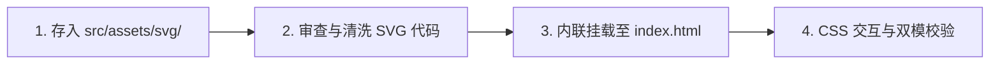

# SVG 矢量资源管理与使用规范 (SVG Asset Workflow)

本项目基于 **Tauri 2 + 原生 Web 前端**，采用极简工程绘图与手绘草图美学。SVG 图标作为界面核心视觉元素，必须严格遵循统一的资产归档、主题双模适配、内联规范与交互标准。

---

## 📁 1. 资产组织与存放规范 (Asset Organization & Naming)

所有新增或引入的原始 SVG 文件必须统一存放在静态资源目录下：

```text
pi-desktop-lite/
└── src/
    └── assets/
        ├── logo.svg           # 程序手绘 Π+ 主徽标
        ├── logo.ico           # 多尺寸 Windows 原生应用图标
        └── svg/
            ├── ic_logo.svg        # 规范化手绘主徽标源文件
            ├── ic_import.svg      # 导入图标
            ├── ic_settings.svg    # 手绘齿轮设置图标
            ├── ic_search.svg      # 搜索图标
            ├── ic_clear.svg       # 清空/重置图标
            └── ic_<name>.svg      # 其他语义化命名的图标
```

- **命名规范**：
  - 统一采用小写字母与下划线蛇形命名（`ic_<action_or_noun>.svg`）；
  - 命名必须具备明确业务或操作语义（如 `ic_import.svg`、`ic_export.svg`、`ic_settings.svg`），禁止 `icon1.svg`、`temp.svg` 等模糊命名；
  - `src/assets/svg/` 存放未经污染的原始矢量定义，作为工程源文件备份与设计溯源。

---

## 🎨 2. 编码规范与主题双模适配 (Theme Adaptation & Attributes)

### 2.1 颜色适配铁律：统一使用 `currentColor`
- ❌ **严禁硬编码具体色值**：严禁在 `<svg>`、`<path>` 或 `<g>` 中写死静态颜色（如 `fill="#1e3150"`、`fill="#000000"`、`stroke="#333333"`）。硬编码会导致暗黑模式下图标隐形或对比度失真；
- ✅ **填充型图标（Fill Icons）**：
  - 必须声明 `fill="currentColor"`；
  - 移除内部所有标签的局部 `fill` 属性，由外部容器的文本颜色（如 `--ink-primary` / `--ink-muted`）统一控制。
- ✅ **描边型图标（Stroke Icons / 手绘草图风）**：
  - 必须声明 `fill="none" stroke="currentColor"`；
  - 统一描边粗细：`stroke-width="1.3"` ~ `1.6`；
  - 端点与拐角处理：必须配置 `stroke-linecap="round" stroke-linejoin="round"`，保留自然笔触质感。

### 2.2 视口与尺寸规范 (ViewBox & Dimensions)
- **严格保留 `viewBox`**：确保矢量图形具备独立坐标系（如 `viewBox="0 0 50 50"`、`viewBox="0 0 24 24"` 或 `viewBox="0 0 48 48"`）；
- **按界面层级精准设定宽高**：
  | 控件场景 | 推荐尺寸 (width × height) | 典型用途 |
  | :--- | :--- | :--- |
  | **标题栏控制按钮** | `12px × 12px` | 最小化、最大化、关闭 |
  | **操作 / 清空按钮** | `16px × 16px` | 搜索框清空 (Esc)、微型操作项 |
  | **设置 / 操作按钮** | `18px × 18px` | 输入框左侧设置按钮、操作指引 |
  | **主体输入框前缀** | `18px × 18px` ~ `20px × 20px` | 搜索图标、导入/操作指引图标 |
  | **品牌徽标 / 大插画** | `42px × 42px` ~ `48px × 48px` | 头部手绘 $\pi+$ Logo、空状态草图 |

---

## 🛠️ 3. 页面集成模式与标准工作流 (Integration Workflow)

### 3.1 首选集成模式：HTML 内联 SVG (Inline SVG)
在桌面端轻量前端架构中，交互型图标**统一采用 HTML 内联模式**挂载：
- **优势**：
  1. 零额外网络/文件请求延迟，界面加载无闪烁；
  2. 深度绑定 CSS 变量，浅色/深色主题毫秒级自适应切换；
  3. 支持 `:hover`、`:focus-within`、`:active` 下的平滑颜色渐变（`transition: color 0.2s`）与微缩放（`transform: scale(1.05)`）。

### 3.2 标准替换与引入 4 步法 (Step-by-Step Workflow)



1. **步骤一（存入资产库）**：将目标 SVG 源文件保存至 `src/assets/svg/ic_<name>.svg`；
2. **步骤二（代码清洗）**：
   - 提取 `<svg>` 根标签与内部 `<path>` / `<g>` 节点；
   - 检查 `viewBox`，将硬编码 `fill` / `stroke` 改为 `currentColor`；
3. **步骤三（内联挂载）**：
   - 在目标容器中以内联方式嵌入，设置标准 `width` 与 `height`；
   - 若为纯装饰图标，添加 `aria-hidden="true"`；若为可点击图标按钮，外层包裹 `<button type="button" aria-label="..." title="...">`；
4. **步骤四（样式与双模验证）**：
   - 在 CSS 中为父级容器设置颜色过渡与悬停动效；
   - 验证浅色绘图纸（Warm Oatmeal）与深色炭黑板（Charcoal Blackboard）下的显示效果。

---

## 💻 4. 标准代码范例 (Code Examples)

### 4.1 填充型图标范例（以 `ic_import.svg` 为例）

```html
<!-- 搜索框前缀导入图标 -->
<div class="search-icon" aria-hidden="true">
  <svg viewBox="0 0 50 50" width="18" height="18" fill="currentColor">
    <path d="M 1.78125 -0.03125 C 1.300781 0.078125 0.960938 0.507813 0.96875 1 L 0.96875 49 C 0.972656 49.566406 1.433594 50.027344 2 50.03125 L 32 50.03125 C 32.566406 50.027344 33.027344 49.566406 33.03125 49 L 33.03125 39 L 30.96875 39 L 30.96875 47.96875 L 3.03125 47.96875 L 3.03125 2.03125 L 30.96875 2.03125 L 30.96875 11 L 33.03125 11 L 33.03125 1 C 33.027344 0.433594 32.566406 -0.0273438 32 -0.03125 L 2 -0.03125 C 1.925781 -0.0390625 1.855469 -0.0390625 1.78125 -0.03125 Z M 24.78125 15.09375 C 24.554688 15.125 24.34375 15.238281 24.1875 15.40625 L 15.28125 24.28125 L 14.59375 25 L 15.28125 25.71875 L 24.1875 34.59375 C 24.429688 34.890625 24.816406 35.027344 25.191406 34.941406 C 25.5625 34.855469 25.855469 34.5625 25.941406 34.191406 C 26.027344 33.816406 25.890625 33.429688 25.59375 33.1875 L 18.4375 26 L 48 26 C 48.359375 26.003906 48.695313 25.816406 48.878906 25.503906 C 49.058594 25.191406 49.058594 24.808594 48.878906 24.496094 C 48.695313 24.183594 48.359375 23.996094 48 24 L 18.4375 24 L 25.59375 16.8125 C 25.90625 16.515625 25.996094 16.050781 25.8125 15.660156 C 25.625 15.265625 25.210938 15.039063 24.78125 15.09375 Z" />
  </svg>
</div>
```

### 4.2 描边型手绘设置按钮范例（以 `ic_settings.svg` 为例）

```html
<!-- 遵循透明底、常态无边框、hover显示边框铁律的设置按钮 -->
<button type="button" id="settings-btn" class="icon-button settings-btn" aria-label="设置" title="设置">
  <svg viewBox="0 0 24 24" width="18" height="18" fill="none" stroke="currentColor" stroke-width="1.4"
    stroke-linecap="round" stroke-linejoin="round">
    <path
      d="M10.2 5.8 C10.3 4.5, 10.4 3.2, 10.4 3.2 L13.6 3.1 C13.6 3.1, 13.7 4.5, 13.8 5.7 C14.6 6.1, 15.4 6.5, 16.2 7.1 L18.6 5.8 L20.3 8.6 L17.8 10.2 C18 11.1, 18 12.9, 17.8 13.8 L20.4 15.4 L18.7 18.2 L16.3 16.9 C15.5 17.5, 14.6 17.9, 13.8 18.3 L13.6 20.9 L10.4 20.8 L10.2 18.2 C9.4 17.8, 8.5 17.4, 7.8 16.9 L5.4 18.2 L3.7 15.4 L6.1 13.8 C5.9 12.9, 5.9 11.1, 6.1 10.2 L3.6 8.6 L5.3 5.8 L7.7 7.1 C8.5 6.5, 9.4 6.1, 10.2 5.8 Z" />
    <path
      d="M12 9.1 C13.6 9.05, 14.95 10.4, 14.9 12 C14.85 13.65, 13.55 14.95, 12 14.9 C10.4 14.85, 9.05 13.55, 9.1 12 C9.15 10.45, 10.45 9.15, 12 9.1 Z" />
  </svg>
</button>
```

### 4.3 样式配合（CSS）

```css
/* 通用按钮规范：透明底、常态无边框、悬浮显示边框 */
.icon-button {
  background: transparent;
  border: 1px solid transparent;
  outline: none;
  cursor: pointer;
  color: var(--ink-muted);
  border-radius: 255px 8px 225px 8px / 8px 225px 8px 255px;
  transition: all 0.18s ease-out;
}

.icon-button:hover {
  color: var(--ink-primary);
  background-color: var(--sketch-tag-bg);
  border-color: var(--sketch-border-subtle);
}

.icon-button:active {
  background-color: var(--sketch-tag-hover-bg);
  border-color: var(--sketch-border);
}

/* 图标容器与颜色联动 */
.search-icon {
  display: flex;
  align-items: center;
  justify-content: center;
  color: var(--ink-muted);
  transition: color 0.2s ease, transform 0.2s ease;
}

/* 输入框聚焦时，图标同步高亮与微缩放 */
.sketch-search-box:focus-within .search-icon {
  color: var(--ink-primary);
  transform: scale(1.05);
}

/* 按钮内 SVG 禁用指针拦截，保障点击精准 */
.titlebar-btn svg,
.icon-button svg {
  pointer-events: none;
  display: block;
}
```

---

## 📋 5. 交付核查自检清单 (Pre-Ship Checklist)

- [ ] **路径归档**：新 SVG 源文件是否已妥善放入 `src/assets/svg/` 并以 `ic_*.svg` 规范命名？
- [ ] **按钮规范**：按钮是否遵从“常态背景透明、常态无边框（1px transparent 占位）、悬浮（hover）时才显示边框”原则？
- [ ] **色值清洗**：是否已剔除所有写死的十六进制色值，全数改为 `currentColor`？
- [ ] **双模适配**：在浅色纸张与深色炭黑模式下，图标颜色与对比度是否正常？
- [ ] **聚焦与悬停**：当父级元素 hover 或聚焦时，图标是否有合理的微交互与颜色过渡？
- [ ] **无障碍属性**：装饰性图标是否带有 `aria-hidden="true"`，操作按钮是否带有 `aria-label` / `title`？
- [ ] **编译闭环**：是否已执行 `cargo check` 且构建顺利通过？
