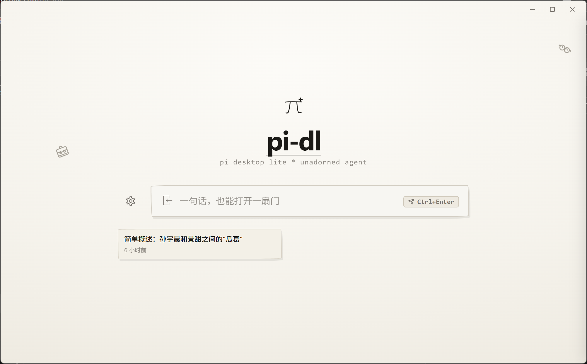
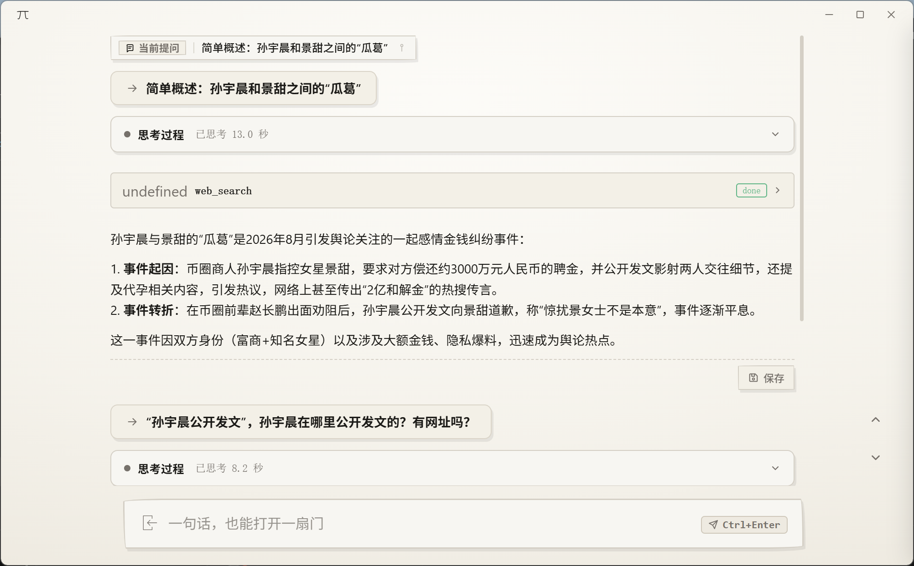

# pi-dl (Tauri Desktop App)

<p align="center">
  <a href="README_en.md">English</a> | <b>简体中文</b>
</p>

一个极简手绘与工程绘图线条风格的桌面端研究与搜索应用，完全忠于pi内核，基于 **Tauri 2 + 原生 Web 前端（HTML / CSS / JS）** 构建。

<p align="center">
  
  
</p>

---

## 🌐 官方资源与生态

- 🔗 **Pi 官方网站**：[https://pi.dev/](https://pi.dev/)
- 📦 **Pi 组件与扩展市场 (Package Gallery)**：[https://pi.dev/packages](https://pi.dev/packages)
- 🐙 **Pi 开源仓库**：[earendil-works/pi (GitHub)](https://github.com/earendil-works/pi)
- 📚 **官方技能库精选**：[Anthropic Skills](https://github.com/anthropics/skills) ｜ [Pi Skills](https://github.com/badlogic/pi-skills)

---

## ✨ 核心特性

- 🤖 **AI-Agent 四态核心界面系统**：
  - **界面1（初始界面-详细版 `detailed`）**：沉浸式标题栏、多行高度自适应输入框（最高 16 行）、方向键历史回溯与草稿暂存、文件/代码拖入与手绘概述胶囊、MRU 动态讯息抽屉与自适应跑马灯；
  - **界面2（初始界面-专注版 `focus`）**：极简纯粹输入模式，保留居中手绘 $\pi$ Logo、自适应输入框与 Mini 任务胶囊；
  - **界面3（Flow 流式交互版 `flow`）**：思维链单行流式刷新与动态读秒、工具调用单行极简提醒（友好工具名 + running/done/failure 状态）、时序步骤流拼接（思维1-工具1-思维2-工具2...一段一段因果拼接且常态紧凑折叠绝不自动展开）、**Typedown 质感 Markdown 预览渲染引擎**（多级标题排版、围栏代码块轻量语法高亮与一键复制、GFM 规范表格、任务清单复选框、GitHub 风格 Callout 警示框、流式未闭合元素自愈容错）、**全域 HTTP/HTTPS 超链接点击唤起系统默认浏览器**、多段对话顶部悬浮提问吸附与轮次定位导航、模型自动重连切换自愈流水线 (`ModelFailoverEngine`)、输出一键保存为桌面 Markdown；
  - **界面4（项目设置独立全屏页面 `settings`）**：非浮窗全屏独立视图，整合常规、模型配置、内核与扩展包市场、会话记录及多预设工作区。
- ⚡ **Flow 后台任务与多进程监管体系**：
  - **双通道解耦与终止防重连铁律**：右键/Esc 无感后台挂起（`TaskManager`）vs 显式中止（`Abort`，手动点击终止全链路绝对禁止触发模型自动重连或切换）；
  - **Mini 任务胶囊与毛玻璃侧边栏**：右上角 `[ ✏️ 1/3 Task ]` 任务胶囊、320px 半透明手绘侧边栏（`backdrop-filter: blur(14px)` + 背景高斯模糊）；
  - **`PiHostPool` 多进程监管**：Rust 原生子进程隔离监管池与单实例多态唤醒路由调度。
- 📎 **多格式文件与文件夹拖入自动链路**：支持直接拖入单个/多个文件或整个代码文件夹，拖入文件夹时直接生成单个文件夹概述胶囊（不展开炸裂为零散子文件）；所有胶囊自然排列在输入框内部上方（支持多行换行与极简滚动条，杜绝横向超界），对话发起时自动注入系统绝对路径供内核原生读取与遍历。
- 🧠 **对话历史沉淀与业务记忆接口**：每轮生成自动持久化完整多轮快照，讯息抽屉双击即时恢复至 Flow 模式，提供标准业务记忆接口层；设置页「会话记录」Tab 支持内核全量会话关键字搜索与时间筛选、「进入 Flow」一键还原完整历史轮次（同步沉淀界面1 讯息卡片），并提供「清空界面会话」（仅清 UI 展示层，绝不触碰 `~/.pi` 内核会话文件）；从会话记录进入 Flow 后右键/Esc 定向回退设置页，再右键照常回界面1（`flowFromSettings` 标志位）。
- 🎨 **手绘工程草图 UI/UX 体系**：全域 20+ 款手绘 SVG 矢量图元（`currentColor` 双模自适应）、隐藏式极简滚动条、手绘弹出微抖动下拉框 (`SketchSelect`)、自定义填表与智能联想引擎 (`SketchAutoFill`) 及居中模态弹窗系统 (`SketchModal`)。
- 🔔 **桌面原生系统集成**：失焦 Windows 原生 Toast 通知与双重锁防护、单实例互斥防重复启动、系统托盘后台常驻与多态唤醒。
- 🛠️ **高性能纯 Rust 后端核心**：Win32 Job Object 内核级孤儿进程收割、无内核平稳待机与全链路交互降级、无感热更新引擎（流式下载 + ProgressStepper 步进 + 一键下载安装最新内核）、**内核保险自动重连机制**（全局后台检测 crashed 状态，自动平滑重连最多 5 次，均失败后左上角红色抖动小闪电提醒并可点击手动重启）、官方包市场与队列管理、并发内存会话索引及全量数据脱敏。

> 📖 **完整特性与架构规范**：详见项目内置开发技能 [`.agents/skills/pi-desktop-overview/SKILL.md`](file:///.agents/skills/pi-desktop-overview/SKILL.md)。

---

## 🔑 第一部分：Pi API 与大模型配置全指南

Pi Agent 支持 **OAuth 订阅账号**、**API 密钥直连**、**环境变量注入** 以及 **自定义/本地/兼容端点**（如 Ollama、vLLM、DeepSeek、硅基流动、OneAPI、Azure 等）。

### 凭据优先级 (Resolution Order)
```text
CLI 命令行参数 (--api-key) ➔ auth.json 文件配置 ➔ 系统环境变量 ➔ models.json 自定义配置
```

---

### 方式 1：交互式命令行登录（最简推荐）

在终端启动 `pi`，输入 `/login` 命令并选择对应提供商：

```bash
# 启动交互模式
pi

# 输入 /login，根据提示选择提供商
/login
```

- **OAuth 订阅登录**：支持 ChatGPT Plus/Pro (Codex)、Claude Pro/Max、GitHub Copilot、xAI (Grok)、OpenRouter、Radius。登录后 Token 自动保存并支持无感刷新。
- **API Key 交互式输入**：直接输入并回车，Pi 会自动加密保存在全局鉴权文件中。

---

### 方式 2：配置文件设置 (`~/.pi/agent/auth.json`)

Pi 的全局凭据保存在用户主目录的 `~/.pi/agent/auth.json` 中（Windows 路径通常为 `C:\Users\<用户名>\.pi\agent\auth.json`）。文件权限建议设为 `0600`（仅用户读写）。

```json
{
  "anthropic": { "type": "api_key", "key": "sk-ant-..." },
  "openai": { "type": "api_key", "key": "sk-..." },
  "deepseek": { "type": "api_key", "key": "sk-..." },
  "google": { "type": "api_key", "key": "AIzaSy..." },
  "opencode": { "type": "api_key", "key": "sk-..." },
  "openrouter": { "type": "api_key", "key": "sk-or-v1-..." },
  "qwen-token-plan": { "type": "api_key", "key": "sk-sp-..." },
  "kimi-coding": { "type": "api_key", "key": "..." },
  "minimax": { "type": "api_key", "key": "..." }
}
```

#### 进阶技巧：动态 Key 与环境变量插值
`auth.json` 中的 `key` 字段支持高级动态解析：
- **环境变量插值**：`"key": "$MY_ANTHROPIC_KEY"` 或 `"${KEY_PREFIX}_KEY"`；
- **密码管理器命令读取**：`"key": "!op read 'op://vault/item/credential'"` 或 `"!security find-generic-password -ws 'anthropic'"`；
- **字面量转义**：`"key": "$$literal_dollar"`。

---

### 方式 3：系统环境变量注入

直接在终端或系统环境变量中设置对应的 API Key 即可：

| 提供商 (Provider) | 环境变量名称 (Environment Variable) | `auth.json` 对应 key |
| :--- | :--- | :--- |
| **Anthropic (Claude)** | `ANTHROPIC_API_KEY` | `anthropic` |
| **OpenAI (GPT-4o/o3)** | `OPENAI_API_KEY` | `openai` |
| **DeepSeek** | `DEEPSEEK_API_KEY` | `deepseek` |
| **Google Gemini** | `GEMINI_API_KEY` | `google` |
| **OpenCode (Zen / Go)** | `OPENCODE_API_KEY` | `opencode` |
| **OpenRouter** | `OPENROUTER_API_KEY` | `openrouter` |
| **xAI (Grok)** | `XAI_API_KEY` | `xai` |
| **Mistral** | `MISTRAL_API_KEY` | `mistral` |
| **Groq** | `GROQ_API_KEY` | `groq` |
| **NVIDIA NIM** | `NVIDIA_API_KEY` | `nvidia` |
| **通义千问 (Qwen)** | `QWEN_TOKEN_PLAN_CN_API_KEY` | `qwen-token-plan-cn` |
| **月之暗面 (Kimi)** | `KIMI_API_KEY` | `kimi-coding` |
| **MiniMax** | `MINIMAX_CN_API_KEY` | `minimax-cn` |
| **Azure OpenAI** | `AZURE_OPENAI_API_KEY`, `AZURE_OPENAI_BASE_URL` | `azure-openai-responses` |
| **Amazon Bedrock** | `AWS_BEARER_TOKEN_BEDROCK` (或 `AWS_PROFILE`) | `amazon-bedrock` |

---

### 方式 4：配置自定义提供商 / 本地模型 / 国内代理 (`~/.pi/agent/models.json`)

若需接入本地模型（Ollama / LM Studio / vLLM）或国内大模型代理聚合平台（OneAPI / NewAPI / 硅基流动），可创建或编辑 `~/.pi/agent/models.json`：

#### 1. 本地 Ollama 示例
```json
{
  "providers": {
    "ollama": {
      "baseUrl": "http://localhost:11434/v1",
      "api": "openai-completions",
      "apiKey": "ollama",
      "compat": {
        "supportsDeveloperRole": false,
        "supportsReasoningEffort": false
      },
      "models": [
        {
          "id": "qwen2.5-coder:7b",
          "name": "Qwen 2.5 Coder 7B (Local)",
          "reasoning": false,
          "contextWindow": 128000
        },
        {
          "id": "deepseek-r1:14b",
          "name": "DeepSeek R1 14B (Local)",
          "reasoning": true,
          "contextWindow": 64000
        }
      ]
    }
  }
}
```

#### 2. 自定义 OpenAI 兼容代理 / 国内平台（如硅基流动、DeepSeek 代理）
```json
{
  "providers": {
    "siliconflow": {
      "baseUrl": "https://api.siliconflow.cn/v1",
      "api": "openai-completions",
      "apiKey": "$SILICONFLOW_API_KEY",
      "models": [
        {
          "id": "deepseek-ai/DeepSeek-V3",
          "name": "DeepSeek-V3 (SiliconFlow)",
          "contextWindow": 64000,
          "reasoning": false
        },
        {
          "id": "deepseek-ai/DeepSeek-R1",
          "name": "DeepSeek-R1 (SiliconFlow)",
          "contextWindow": 64000,
          "reasoning": true
        }
      ]
    }
  }
}
```

> 💡 `models.json` 支持热加载，在会话中直接修改即可生效，无需重启 Pi。

---

### 方式 5：全局默认模型与思考强度设置 (`~/.pi/agent/settings.json`)

在 `~/.pi/agent/settings.json` 中可指定启动默认模型、默认提供商与思考预算（Thinking Level）：

```json
{
  "defaultProvider": "anthropic",
  "defaultModel": "claude-sonnet-4-20250514",
  "defaultThinkingLevel": "medium",
  "thinkingBudgets": {
    "minimal": 1024,
    "low": 4096,
    "medium": 10240,
    "high": 32768
  },
  "defaultProjectTrust": "always"
}
```
- **Thinking Level 可选值**：`"off"`、`"minimal"`、`"low"`、`"medium"`、`"high"`、`"xhigh"`、`"max"`。

---

## 🧩 第二部分：Pi 组件（Packages / Skills / Extensions）下载与配置全指南

Pi 拥有高度可扩展的生态体系，包含 **Packages（一体化扩展包）**、**Skills（任务技能库）** 与 **Extensions（TypeScript 深度扩展插件）**。

---

### 1. Pi 包管理器 (Pi Packages)

Pi 内置了类似 npm/cargo 的一体化包管理命令，可自动下载并链接扩展、技能、Prompt 模板与主题。

#### ① 下载与安装组件包
```bash
# 1. 通过 npm 安装公开组件包
pi install npm:@foo/bar@1.0.0
pi install npm:pi-skills

# 2. 通过 GitHub / Git 仓库直接安装
pi install git:github.com/user/my-pi-package@v1.0
pi install https://github.com/badlogic/pi-skills

# 3. 通过本地开发目录安装
pi install ./my-local-package
pi install C:/Users/name/my-tools/package

# 4. 项目局部安装（仅在当前仓库生效，写入 .pi/settings.json）
pi install -l npm:@org/repo-tools
```

#### ② 组件包管理常用命令
```bash
pi list                     # 查看当前已安装的所有组件包
pi remove npm:@foo/bar      # 卸载指定组件包
pi update --all             # 更新 Pi 自身与所有已安装的组件包
pi update --extensions      # 仅更新扩展与组件包（保持 Pi 版本不变）
pi update npm:@foo/bar      # 更新单一指定组件包
```

#### ③ 免安装临时试用（当前会话有效）
```bash
# 无需正式安装，仅在单次执行中临时加载体验
pi -e npm:@foo/bar
pi -e git:github.com/user/repo
```

---

### 2. 技能组件 (Skills - 遵循 Agent Skills 规范)

Skills 为模型提供**按需加载的专业工作流、规范指南与辅助脚本**（符合 [Agent Skills Specification](https://agentskills.io/specification)）。

#### ① 技能存放目录
Pi 启动时会自动扫描以下目录中的 Skills：
- **全局技能目录**：
  - `~/.pi/agent/skills/`
  - `~/.agents/skills/`
- **项目局部技能目录**：
  - 当前项目根目录下的 `.pi/skills/`
  - 当前项目根目录及父目录下的 `.agents/skills/`

#### ② 共享复用 Claude Code 与 OpenAI Codex 技能库
若已有 Claude Code 或 Codex 技能库，可在 `~/.pi/agent/settings.json` 中直接引用：
```json
{
  "skills": [
    "~/.claude/skills",
    "~/.codex/skills"
  ]
}
```

#### ③ 技能标准结构规范 (`SKILL.md`)
每个技能通常为一个独立文件夹，根目录下必须包含 `SKILL.md`：
```text
my-custom-skill/
├── SKILL.md              # [必须] 包含 YAML Frontmatter 元数据与使用指导
├── scripts/              # [可选] 辅助自动化执行脚本 (bash / js / py)
└── references/           # [可选] 详细参考文档与架构模板
```

`SKILL.md` 模板示例：
````markdown
---
name: my-custom-skill
description: 专门用于处理数据清洗、格式转换与生成报告的技能。当用户提到数据分析或报表生成时使用。
---

# My Custom Skill

## 使用说明
运行以下脚本开始数据处理：
```bash
node ./scripts/process.js --input data.csv
```
````

#### ④ 技能触发方式
- **自动渐进式加载（Progressive Disclosure）**：Pi 默认将所有技能的 `description` 放入系统提示词，当用户任务匹配时，模型会自动通过 `read` 工具读取完整 `SKILL.md` 并执行；
- **手动强制调用**：在交互框中输入 `/skill:<skill-name>`（例如 `/skill:brave-search`）直接执行。

---

### 3. 扩展与工具组件 (Extensions)

Extensions 是使用 TypeScript 编写的运行级扩展，可以直接向 LLM 注册新工具（Custom Tools）、拦截工具调用（安全确认拦截）、监听生命周期或注册自定义 `/command`。

#### ① 扩展存放与自动发现目录
- **全局扩展**：`~/.pi/agent/extensions/*.ts` 或 `~/.pi/agent/extensions/*/index.ts`
- **项目局部扩展**：`.pi/extensions/*.ts` 或 `.pi/extensions/*/index.ts`

#### ② 编写自定义扩展示例
创建 `~/.pi/agent/extensions/custom-tools.ts`：
```typescript
import type { ExtensionAPI } from "@earendil-works/pi-coding-agent";
import { Type } from "typebox";

export default function (pi: ExtensionAPI) {
  // 1. 注册一个供 LLM 调用的自定义工具
  pi.registerTool({
    name: "fetch_weather",
    label: "Fetch Weather",
    description: "根据城市名称查询实时天气信息",
    parameters: Type.Object({
      city: Type.String({ description: "城市名称，如 Beijing" }),
    }),
    async execute(toolCallId, params, signal, onUpdate, ctx) {
      // 执行业务逻辑
      return {
        content: [{ type: "text", text: `${params.city} 当前天气：晴朗，气温 22°C` }],
        details: {},
      };
    },
  });

  // 2. 注册危险操作前置安全拦截器
  pi.on("tool_call", async (event, ctx) => {
    if (event.toolName === "bash" && event.input.command?.includes("rm -rf")) {
      const confirmed = await ctx.ui.confirm("高危命令拦截", "是否允许执行删除操作？");
      if (!confirmed) {
        return { block: true, reason: "用户拒绝执行高危删除操作" };
      }
    }
  });

  // 3. 注册自定义斜杠命令
  pi.registerCommand("ping", {
    description: "测试扩展连通性",
    handler: async (args, ctx) => {
      ctx.ui.notify("Pong! 扩展运行正常", "info");
    },
  });
}
```

#### ③ 热重载扩展
修改扩展代码后，在 Pi 交互界面中输入 `/reload` 即可瞬间热重载所有扩展，无需重启应用。

---

### 4. 交互式组件管理 (`pi config`) 与项目信任机制

#### ① 交互式组件管理器 (`pi config`)
在终端运行 `pi config`，将启动手绘 TUI 图形面板：
- 按 `Tab` 键可自由切换 **全局配置** (`~/.pi/agent/settings.json`) 与 **项目局部配置** (`.pi/settings.json`)；
- 使用上下光标键与回车键，可直观启用/禁用各个 Packages、Extensions、Skills 与 Themes。

#### ② 项目信任机制 (Project Trust)
为了保证本地代码执行安全性，Pi 默认对未信任的项目路径进行防护：
- 交互模式下首次打开包含 `.pi` 扩展的项目会弹出信任确认；
- 输入 `/trust` 可将当前项目加入信任名单 (`~/.pi/agent/trust.json`)；
- 若希望全局默认信任，可在 `~/.pi/agent/settings.json` 中配置 `"defaultProjectTrust": "always"`。

---

## 🚀 快速开始开发与运行桌面端

### 1. 安装依赖
```bash
npm install
```

### 2. 极速编译检查（推荐日常迭代与修改后验证，~1s）
```bash
npm run check
```

### 3. 启动桌面端开发调试
```bash
npm run dev
# 或
node scripts/tauri.js dev
```

### 4. 构建测试（生成二进制，无需安装包打包）
```bash
npm run build:check
```

### 5. 正式发布安装包构建
```bash
npm run build
```

### 6. 多工作区切换与 code-area 路由调度中枢（设置 → 工作区）

1. 点击主界面左下角手绘齿轮按钮进入「设置」独立全屏页；
2. 在左侧 Tab 栏点击 **「工作区」**；
3. 顶部「当前工作区」卡片展示生效工作区名称、ID 徽章与运行时绝对路径；
4. **`code-area` 路由工作区与技能调度中枢（专享特性）**：
    - 基于 Rust `rfd` (IFileOpenDialog) 实现 Windows 原生 OpenFolder 文件夹选择器（右下角为标准的「选择文件夹」/「打开」，无网页上传提示），支持浏览目录、绝对路径手动输入与历史最近项目快速切换；
   - **存在性自动校验与自愈清理**：每次切换到 `code-area` 或启动应用时，自动校验当前绑定的路由目录与历史项目是否存在，若已被删除则自动清空选项并清理失效历史；
   - 展现当前 `code-area` 已装载的「内置编码技能集」清单（开发端可在 `code-area/.agents/skills/` 自由增减技能）；
   - 运行时 `code-area` 自身不修改内部文件，而是调度内置技能指挥操作外部路由目标项目；
5. 下方「预设工作区」列表罗列全部内置模板（`default-area`、`code-area`、`research-area`），已物化的条目展示运行时路径，当前项标记「使用中」；
6. 点击非当前项的「切换」按钮即完成切换：
   - 允许先切换到 `code-area`，再在设置面板或主界面中择时绑定路由目标；
   - 若未绑定路由目标项目，主界面输入框禁止输入（只读提示），点击输入框可直接弹出绑定对话框；
   - 首次选中会整目录复制模板到 `~/.pi-dl/workspaces/<id>/`（`default-area` 沿用 `~/.pi-dl/default-area`，零迁移零覆盖）；
   - 若有任务正在运行会先弹出手绘确认，明确“仅对之后的新会话生效”；
   - 主宿主空闲时自动重启内核重新锚定 CWD；否则提示“主会话将在空闲后重启生效”。

---

## 📁 目录结构

```text
pi-desktop-lite/
├── .agents/skills/             # 项目技能规范定义 (auto-compile-and-fix, iterative-modification-hygiene, sketch-drafting-ui, clean-code-refactoring 等)
├── .mytools/pi-body/           # 最新 Pi Agent Release 引擎包 (打包发布时自动内嵌作为 App Bundle Resources，开箱即用)
├── default-area/               # Pi 默认工作区目录（含 AGENTS.md 运行时自我描述，打包与运行时隔离工作空间）
├── workspaces/                 # 公共预设工作区模板源（code-area 代码工程区 / research-area 深度调研区，随安装包打包发布）
│   ├── code-area/              #   代码工程向全局调度中枢模板（workspace.json + AGENTS.md + README.md + .agents/skills/ 内置技能集）
│   └── research-area/          #   深度调研向模板（workspace.json + AGENTS.md + README.md）
├── custom-workspaces/          # [私有化] 私人定制/专有交付工作区（如 enterprise-consulting-area，.gitignore 物理隔离，不随安装包打包，定向交付）
├── scripts/                    # 自动化与环境配置脚本 (tauri.js, check.js)
├── src/                        # 前端页面源码与运行时资源
│   ├── assets/                 # 静态资源 (logo.svg, logo.ico, 手绘 SVG 图标)
│   ├── lib/                    # 跨模块共享基础件
│   │   ├── dom-utils.js        # HTML 转义 / CSS 选择器值转义工具
│   │   ├── icons.js            # currentColor 手绘 SVG 图元字典
│   │   └── view-constants.js   # 四态界面 (detailed / focus / flow / settings) 常量
│   ├── modules/                # 按功能域拆分的 UI 业务模块（由 main.js 统一编排）
│   │   ├── view-mode.js        # 四态状态机与设置页打开/关闭路由
│   │   ├── preferences.js      # 主题、发送快捷键、Tokens 规范吸附
│   │   ├── settings-navigation.js # 设置 Tab / 内层步骤 / 折叠通道抽屉
│   │   ├── model-panel.js      # 模型白名单 MRU 与官方通道配置
│   │   ├── custom-provider-panel.js # 两步式自定义通道与模型管理
│   │   ├── kernel-panel.js     # 内核状态、版本检查与一键更新
│   │   ├── sessions-panel.js   # 会话记录列表、搜索筛选、进入 Flow 管线与界面会话清空
│   │   ├── window-controls.js  # 标题栏窗口控制
│   │   ├── flow-ui.js          # Flow 渲染核心：Markdown、轮次 DOM、悬浮提问提示、上下定位导航
│   │   ├── flow-stream.js      # 流式状态机、错误卡渲染与自动重连胶囊
│   │   ├── flow-pipeline.js    # 提问下发、工具调用事件、自愈引擎与发送拦截
│   │   ├── task-panel.js       # 后台任务胶囊、侧边栏、历史恢复与快照归档
│   │   ├── file-attachments.js # 文件拖入、概述胶囊与多模态路径注入
│   │   ├── search-input.js     # 输入交互、历史翻阅、格言跑马灯与焦点控制
│   │   ├── packages-panel.js   # 扩展组件市场与安装/更新/卸载队列
│   │   ├── workspace-panel.js  # 多预设工作区设置面板（当前卡片/预设列表/切换确认）
│   │   └── global-interactions.js # 全局右键/Esc 回退与窗口生命周期保护
│   ├── services/               # 前端服务层
│   │   ├── tauri-bridge.js     # 统一 Tauri IPC 跨平台调用桥接器
│   │   ├── config-service.js   # ~/.pi/agent 配置与模型白名单管理服务
│   │   ├── pi-client.js        # 对接 Rust 后端 supervisor 的流式通信客户端
│   │   ├── session-service.js  # 历史会话管理与切换服务
│   │   ├── workspace-service.js # 多预设工作区 IPC 服务（列表/当前/切换）
│   │   └── version-service.js  # 版本检测与更新通知服务
│   ├── styles/                 # 按功能域拆分的手绘样式（styles.css 仅作 @import 聚合入口）
│   │   ├── tokens.css          # 浅色 / 深色主题令牌
│   │   ├── base.css            # 基础重置与隐藏式滚动条
│   │   ├── layout.css          # 标题栏与四态视图布局
│   │   ├── flow.css            # Flow 对话流与思考/回复卡片
│   │   ├── search.css          # 搜索输入区与通用按钮
│   │   ├── message-drawer.css  # 历史讯息抽屉
│   │   ├── animations.css      # 全局关键帧动画
│   │   ├── settings.css        # 设置独立全页面视图
│   │   ├── form-widgets.css    # 手绘自动填表与自定义下拉控件
│   │   ├── custom-provider.css # 两步式自定义通道样式
│   │   ├── tool-response.css   # 工具卡片、Markdown 回复与错误卡
│   │   ├── packages.css        # 内核面板与组件市场
│   │   └── overlays.css        # 漂浮图标、任务侧边栏、Toast 与模态
│   ├── index.html              # 页面主体（沉浸式标题栏 + 手绘Logo + 四态界面容器 + 独立设置视图）
│   ├── styles.css              # 样式聚合入口（@import 至 styles/ 各功能域子文件）
│   └── main.js                 # 前端编排入口：DOM 引用收集 + 共享上下文构建 + 模块初始化
├── src-tauri/                  # Tauri (Rust) 高性能后端核心
│   ├── Cargo.toml              # 依赖: tokio, serde, dashmap, notify, reqwest, regex, windows-sys
│   ├── tauri.conf.json         # 窗口无边框、原生透明与安全策略配置
│   ├── inner-skills/           # [核心] 桌面应用运行时动态注入 Pi Agent 的内置约束技能与规则 (RULES.md, bash兼容, OCR文档解析, 多Agent, 联网搜索, 长期记忆, 工作流, 上下文修剪)
│   └── src/
│       ├── lib.rs              # Tauri 状态初始化、命令注册、事件广播与托盘集成
│       ├── main.rs             # 程序主入口
│       ├── config_manager.rs   # [核心] 配置管理与目录映射
│       ├── workspace/          # [核心] 多预设工作区模块（模板发现 / 运行时物化 / workspace.activeId 配置读写）
│       ├── package_manager/    # [核心] 官网组件市场检索、安装/卸载与版本更新子系统
│       ├── pi_runner/          # [核心] 进程管理、Win32 Job Object 孤儿收割、严格 LF 分帧器、Inner-Skills 动态注入引擎
│       ├── security/           # [核心] 正则脱敏中间件 (API Key / 用户隐私路径自动脱敏)
│       ├── session/            # [核心] DashMap 内存会话索引与 notify 增量文件监视
│       └── version_watcher/    # [核心] Jitter 随机抖动版本监测与双源更新探测

├── AGENTS.md                   # 项目规则与代理行为准则
├── README.md                   # 项目介绍与完整配置指南（中文）
├── README_en.md                # 英文介绍与完整配置指南（English）
└── package.json

```
