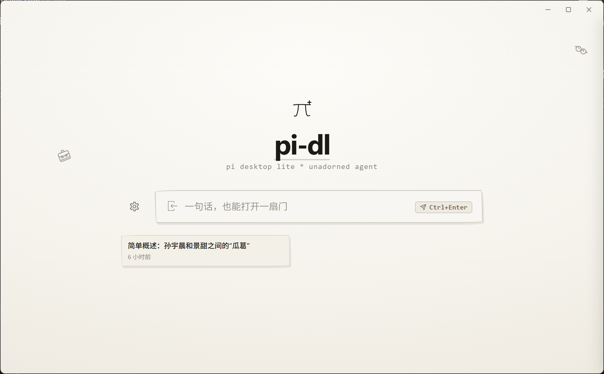
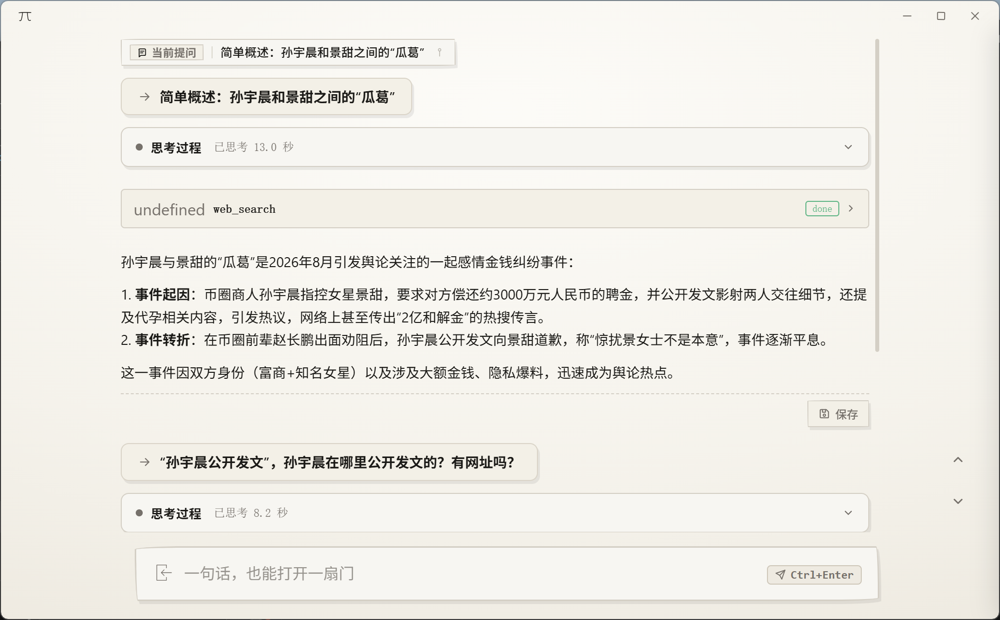

# pi-dl (Tauri Desktop App)

<p align="center">
  <b>English</b> | <a href="README.md">简体中文</a>
</p>

A desktop research and reasoning application with minimalist hand-drawn sketch & architectural drafting aesthetics, fully adhering to the core Pi engine ecosystem, built on **Tauri 2 + Native Web Frontend (HTML / CSS / JS)**.

<p align="center">
  
  
</p>

---

## 🌐 Official Resources & Ecosystem

- 🔗 **Pi Official Website**: [https://pi.dev/](https://pi.dev/)
- 📦 **Pi Package Gallery**: [https://pi.dev/packages](https://pi.dev/packages)
- 🐙 **Pi Open Source Repository**: [earendil-works/pi (GitHub)](https://github.com/earendil-works/pi)
- 📚 **Curated Skills Repositories**: [Anthropic Skills](https://github.com/anthropics/skills) ｜ [Pi Skills](https://github.com/badlogic/pi-skills)

---

## ✨ Core Feature Highlights

- **Hand-Drawn Architectural Drafting Aesthetics**: 1.2~1.4px ink sketch line frames with gentle dual-theme paper backgrounds, completely free of system emojis, unified hand-drawn SVG assets;
- **Four-State Minimalist Flow**: Detailed view (multi-line input, history traversal, multimodal attachment capsules) ➔ Focus view ➔ Flow streaming view ➔ Settings full page, with global Step Back via right-click or Esc;
- **Flow Sequential ReAct Step Stream**: Compact single-line thinking steps, point phases, and tool slices that never expand automatically;
- **Plan Execution Visualization**: Markdown checkbox plan lists (todo list) emitted by the model during multi-step tasks are parsed in real time — a progress indicator (completed/total) sits at the top-right (left of the task capsule, with a running arc-glow and an emerald all-completed state); clicking it opens the right-side translucent frosted-glass plan sidebar (background blur, same style as the task sidebar) listing every plan step; each step is grayed out and struck through once completed. **Session-scoped display & elimination lifecycle**: the indicator only shows the current foreground session's plan while inside the Flow view (it hides immediately upon right-click exiting the session view and never lingers for a previous session; it is consistently restored when re-entering a session that has a plan); after a task completes the plan info persists and is fully eliminated only by ① starting the next conversation turn, or ② clicking the "End Plan" button at the bottom of the plan sidebar (visible only when all items are completed) — an eliminated plan never resurrects via history re-entry;
- **Direct Image Display & One-Click Desktop Save**: Model-generated and outputted images render directly in the Flow view (supports Markdown images, HTML tags, and standalone image paths); local disk images securely resolve to Data URLs via Rust IPC with frontend Map caching; supports full-screen lightbox zoom, sketch action bar with "One-Click Save to Desktop" (incremental naming + emerald checkmark feedback), and file explorer revealing; pure image generation tasks automatically self-heal and inject preview cards if the model omits Markdown syntax;
- **Typedown Markdown & External Link Interception**: Code blocks with hand-drawn language badges and copy feedback, Callout alerts, and safe external link opening via the default system browser;
- **Image Generation & Multimodal Routing**: Managed within top-parallel sub-tabs inside the "Model Configuration" page in Settings. When the active model is text-only and an image generation or multimodal vision inspection task is detected, automatically route to the configured model (image generation strictly requires OpenAI-compatible /images/generations or DashScope async interfaces; vision inspection supports multimodal vision LLMs); upon task completion, seamlessly return to the original model and inject outputs back;
- **Session Rollback & File Restoration**: Forks kernel history nodes and safely restores modified/deleted files based on pre-execution snapshots (newly added files are never removed);
- **`code-area` Routing Hub**: Physical CWD stays anchored at the central Hub skills repository, dispatching tasks to external projects via native Windows folder picker without self-pollution.

> 📖 **Full feature list, the 23 interaction ironclads, and architecture specs**: see the development skills under [`.agents/skills/`](.agents/skills/) — overview & feature matrix: [`pi-desktop-overview`](.agents/skills/pi-desktop-overview/SKILL.md); interaction ironclads: [`desktop-interaction-invariants`](.agents/skills/desktop-interaction-invariants/SKILL.md); Flow details: [`flow-interaction-pattern`](.agents/skills/flow-interaction-pattern/SKILL.md).

---

## 🚀 Quick Start & Desktop Development

> ⚠️ **Important Prerequisite**: Before launching the project, please extract [`.mytools/pi-body/pi-windows-x64.7z`](.mytools/pi-body/pi-windows-x64.7z) (extract into `.mytools/pi-body/pi-windows-x64/` containing `pi.exe` and core binaries).

### Common Commands
```bash
# 1. Install dependencies
npm install

# 2. Fast compilation check (~1s, recommended for daily iterations)
npm run check

# 3. Start desktop dev mode
npm run dev

# 4. Frontend static gate (syntax + import graph + named exports matching + circular dependencies, required before composite refactors)
npm run check:fe

# 5. Coupling metrics baseline (automated decoupling indicators)
npm run measure:coupling

# 6. Build check (compile binaries without full packaging)
npm run build:check

# 7. Build release installer package
npm run build
```

### Multi-Workspace Switching & `code-area` Routing
1. Click the gear icon on the bottom-left to enter Settings full-page, select **"Workspaces"** in the left sidebar;
2. **`code-area` Routing Hub Features**:
   - Native Windows OpenFolder dialog via Rust `rfd` (IFileOpenDialog) supporting directory browsing, direct path input, and MRU project switching;
   - Auto-validates target directory existence upon startup/switching and cleans up stale items;
   - `code-area` hosts central Hub skills (`code-area/.agents/skills/`), dispatching commands to external routed target projects without polluting its own files;
3. **Workspace Switching**: Click "Switch" in the presets list (materializes workspace template into `~/.pi-dl/workspaces/<id>/`, automatically restarting idle kernel to re-anchor CWD).

---

## ⚙️ Pi Ecosystem Configuration
 
Pi Desktop Lite fully adheres to the native Pi kernel ecosystem, supporting various LLM integrations (OAuth / API Key / environment variables / local Ollama) as well as rich extension components (Packages / Agent Skills / TypeScript Extensions).

> 📖 **Configuration & Ecosystem Guide**: For complete instructions on model authentication, custom endpoints, package management, and extension development, please refer to [`.agents/skills/pi-ecosystem-configuration/SKILL.md`](.agents/skills/pi-ecosystem-configuration/SKILL.md).

---

## 📁 Project Directory Topology

```text
pi-desktop-lite/
├── .agents/skills/             # Development-level agent skill definitions (overview / interaction ironclads / Flow pattern / ecosystem config / compile gates; routing matrix in AGENTS.md)
├── .mytools/pi-body/           # Bundled Pi Agent Release engine (contains pi-windows-x64.7z, extract to pi-windows-x64 before development)
├── default-area/               # Default workspace template & runtime isolation sandbox
├── workspaces/                 # Public preset workspace templates (code-area hub / research-area)
├── scripts/                    # Automation and build scripts (tauri.js, check.js, check-frontend.js, measure-coupling.js)
├── src/                        # Frontend source code and assets
│   ├── assets/                 # Static assets (logo.svg, logo.ico, hand-drawn SVG icons)
│   ├── lib/                    # Shared foundational utilities (dom-utils, icons, markdown-renderer, view-constants, event-bus, el-binder, contracts single contract registry)
│   ├── modules/                # Feature-scoped UI modules orchestrated by main.js
│   │   ├── view-mode.js        # Four-state state machine & settings routing
│   │   ├── flow-ui.js          # Flow rendering: Markdown, turns DOM, floating tip, turn navigation
│   │   ├── flow-render.js      # Flow pure rendering layer (side-effect free, explicit imports)
│   │   ├── flow-dom.js         # Flow read-only DOM references (createFlowDom → ctx.flowDom)
│   │   ├── flow-state-view.js  # Flow view-derived cache owner (sealed flowView object)
│   │   ├── flow-stream.js      # Stream state machine, error cards, reconnect capsules & grace period
│   │   ├── flow-pipeline.js    # Prompt dispatch, tool call events, built-in reconnect engine
│   │   ├── flow-human-input.js # Mid-run ask-back: answer bars + dialogs + extension_ui_response write-back
│   │   ├── flow-file-changes.js # Session file-change collector (per-Task stores, consistent restore on re-entry)
│   │   ├── flow-plan-panel.js  # Plan execution visualization: model todo-list parsing, top-right progress indicator, plan sidebar & session-scoped elimination lifecycle
│   │   ├── flow-rollback.js    # Session rollback orchestration (kernel fork + file restoration + prune re-render + toast)
│   │   ├── task-panel.js       # Background task capsule, sidebar, history restore
│   │   ├── sessions-panel.js   # Session records, search/filter, enter Flow pipeline
│   │   ├── token-telemetry.js  # Quota telemetry icon: context usage / mean speed / tokens consumed panel + history backfill
│   │   ├── image-routing-panel.js # Dedicated panel for image generation & multimodal routing
│   │   ├── workspace-panel.js  # Workspace management panel and routing binding
│   │   └── global-interactions.js # Global Step Back & URL interceptor
│   ├── services/               # Frontend service layer (tauri-bridge, config-service, pi-client, multimodal-detector, image-routing-engine, model-failover, workspace-service)
│   │   └── stores/             # Shared mutable state owners (view-store, settings-store, attachments-store, flow-store per-taskId compartments)
│   ├── styles/                 # Feature-scoped sketch styles (tokens, layout, flow, markdown, settings)
│   ├── index.html              # Main HTML container
│   ├── styles.css              # Aggregated style entry (@import to styles/ subfiles)
│   └── main.js                 # Main orchestrator entry
├── src-tauri/                  # High-performance Tauri (Rust) backend
│   ├── extensions/             # Built-in kernel extensions (pi-rollback-guard.ts snapshot guard, pi-tool-sanitizer.ts full-chain tool call sanitizer: 0.86.0 tool anchoring restoration / tool name recovery / argument auto-unwrap / private-protocol tag extraction / empty & strict tools filter)
│   ├── inner-skills/           # Runtime inner-skills (RULES.md mapping index + 9 on-demand injected skills; mechanism in inner-skills-injection skill)
│   └── src/                    # Rust core source (lib.rs, main.rs, commands/, config_manager/, workspace, pi_runner, security, session)
├── AGENTS.md                   # Project rules and agent guidelines (condensed invariants + skill routing matrix)
├── README.md                   # Project overview & configuration guide (Chinese)
├── README_en.md                # Project overview & configuration guide (English)
└── package.json
```
